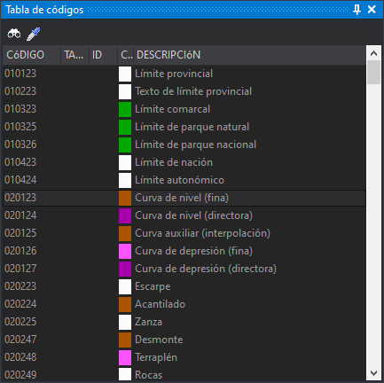

# Tabla de códigos

Este permite seleccionar el código activo al estilo de cómo lo haríamos con la [barra de herramientas Código](../barras-de-herramientas/codigo.md) pero mostrando todos los códigos simultáneamente.

Este panel se habilita únicamente si seleccionamos la opción **Panel de códigos \(mono-codificación\)** en el campo [Interfaz para seleccionar código](../cuadros-de-dialogo/configuracion/diging.md#interfaz-para-seleccionar-codigo) de la configuración del programa.

