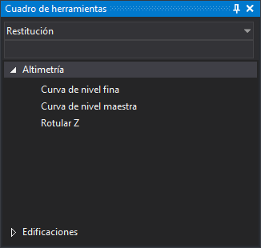

# Cuadro de herramientas

Este panel muestra el cuadro de herramientas configurado en la tabla de códigos activa.

## Mostrar el panel

Se puede mostrar el panel de las siguientes formas:

* Pulsando el botón correspondiente en la [barra de herramientas Paneles](../barras-de-herramientas/paneles.md).
* Mediante la opción del menú **Ventana/Cuadro de herramientas**.

