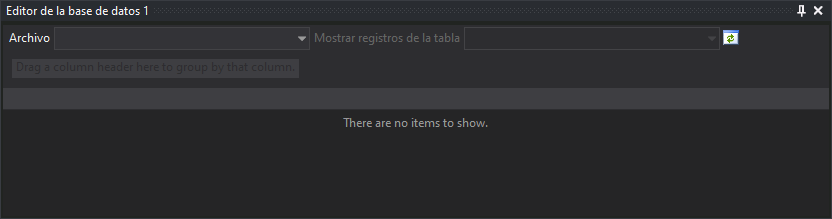

# Editor de la base de datos 1,2,3,4

Permite editar la base de datos conectada con un determinado archivo de dibujo.

## Mostrar el panel

Se puede mostrar el panel de las siguientes formas:

* Pulsando el botón correspondiente en la [barra de herramientas Paneles](../barras-de-herramientas/paneles.md).
* Mediante la opción del menú **Base de Datos/Editor de la base de datos**.

