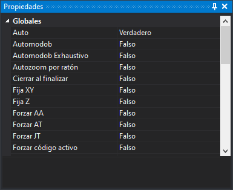

# Propiedades

Este panel muestra y permite cambiar el estado de las órdenes de tipo variable.

## Mostrar el panel

Se puede mostrar el panel de las siguientes formas:

* Pulsando el botón correspondiente en la [barra de herramientas Paneles](../barras-de-herramientas/paneles.md).
* Mediante la opción del menú **Ventana/Otras ventanas/Propiedades**.

