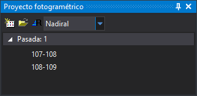

# Proyecto fotogramétrico

Permite crear archivos de proyecto fotogramétrico, así como cargar archivos de proyectos fotogramétricos creados por otros programas.

Una vez cargado un proyecto fotogramétrico, el contenido principal muestra un árbol con tantas ramas como pasadas se enumeren en el archivo de proyecto fotogramétrico y con tantas hojas como modelos existan en el proyecto.

Al pulsar sobre un modelo se creará una ventana fotogramétrica mostrando dicho modelo o en caso de tener ya abierta una ventana fotogramétrica, se cambiará el modelo por el seleccionado.

## Barra de herramientas

Dispone de una barra de herramientas que permite interactuar con el contenido del panel.

### Botones

* Botón para crear un nuevo archivo de proyecto fotogramétrico.
* Botón para cargar un archivo de proyecto fotogramétrico existente.
* Botón para activar el cambio automático de modelo.
* Desplegable que permite seleccionar el punto de vista en caso de que el archivo de proyecto fotogramétrico cargado proporcione distintos puntos de vista desde una misma estación.

## Mostrar el panel

Se puede mostrar el panel de las siguientes formas:

* Pulsando el botón correspondiente en la [barra de herramientas Paneles](../barras-de-herramientas/paneles.md).
* Mediante la opción del menú **Ventana/Proyecto fotogramétrico**.

