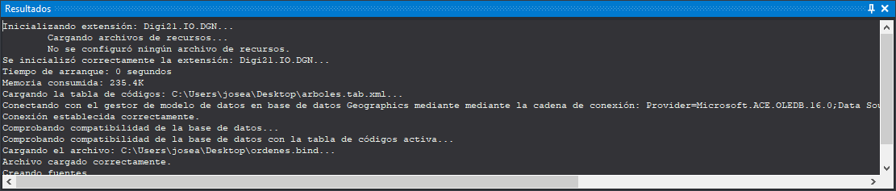

# Resultados

Este panel muestra resultados generados por ciertas órdenes como la orden [BININFO](../ventana-de-dibujo/ordenes/b/bininfo.md).

## Mostrar el panel

Se puede mostrar el panel de las siguientes formas:

* Pulsando el botón correspondiente en la [barra de herramientas Paneles](../barras-de-herramientas/paneles.md).
* Mediante la opción del menú **Ventana/Resultados/Resultados**.

