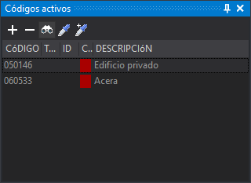

# Códigos activos

Este panel permite seleccionar el código o códigos activos en caso de estar trabajando con multi codificación.

Al almacenar una geometría nueva, esta tendrá tantos códigos como códigos tengamos seleccionados en este panel.

Este panel se habilita únicamente si seleccionamos la opción **Panel de multi-codificación** en el campo [Interfaz para seleccionar código](../cuadros-de-dialogo/configuracion/diging.md#interfaz-para-seleccionar-codigo) de la configuración del programa.

## Barra de herramientas

Dispone de una barra de herramientas que permite interactuar con el contenido del panel.

### Botones

* Botón que añade un código al listado de códigos activos.
* Botón elimina el código seleccionado del listado de códigos activos.
* Botón que ejecuta la orden [COD](../ventana-de-dibujo/ordenes/c/cod.md).
* Botón que ejecuta la orden [CLONAR\_CODIGOS](../ventana-de-dibujo/ordenes/c/clonar-codigos.md).
* Botón que ejecuta la orden [CLONAR\_CODIGOS+](../ventana-de-dibujo/ordenes/c/clonar-codigos-mas.md).

## Base de datos

Si estamos trabajando con una base de datos, al seleccionar un determinado código en este panel se forzará al panel [Campos de la base de datos](campos-de-la-base-de-datos.md) a que muestre la [tabla configurada](../editor-de-tablas-de-codigos/pestanas/codigos/base-de-datos.md#tabla) en la tabla de códigos para el código seleccionado.

