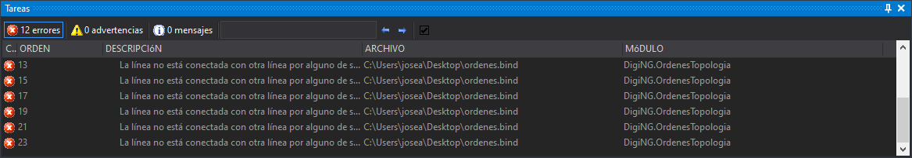

# Tareas

Este panel muestra tareas \(habitualmente errores\) generadas por órdenes que son capaces de generar tareas, como por ejemplo la orden [DETECTAR\_LINEAS\_NO\_CONECTADAS](../ventana-de-dibujo/ordenes/d/detectar-bucles.md).

Las tareas se muestran en el contenido principal del panel con cuatro columnas:

| Columna | Descripción |
| :--- | :--- |
| Tipo | Muestra un icono indicando si la tarea es un Error, una Advertencia o un Mensaje. |
| Descripción | Descripción del error/advertencia/mensaje. |
| Archivo | Archivo al que pertenece la geometría que ha desencadenado que se genere la tarea. |
| Módulo | Extensión de Digi3D.NET que implementa la orden que ha generado la tarea. |

Estas columnas son ordenables, de manera que, si pulsamos sobre el título de una columna, se ordenará por dicha columna o ascendente o descendentemente, en función del número de veces que pulsamos el título de la columna.

Si hacemos doble clic sobre una tarea se desencadenará una acción que podrá ser que el programa centre una geometría en la ventana de dibujo, que haga un zoom extendido a una geometría, que se muestre un cuadro de diálogo, etc.

## Barra de herramientas

Dispone de una barra de herramientas que permite interactuar con el contenido del panel.

### Botones

* Botón que activa/desactiva la visualización de tareas marcadas como error.
* Botón que activa/desactiva la visualización de tareas marcadas como advertencia.
* Botón que activa/desactiva la visualización de tareas marcadas como mensaje.
* Cuadro para introducir un criterio de búsqueda.
* Botón que ejecuta la siguiente tarea que tenga la palabra introducida en cuadro de búsqueda.
* Botón que ejecuta la tarea anterior que tenga la palabra introducida en cuadro de búsqueda.
* Botón que activa/desactiva la visualización de tareas ocultas.

## Mostrar el panel

Se puede mostrar el panel de las siguientes formas:

* Pulsando el botón correspondiente en la [barra de herramientas Paneles](../barras-de-herramientas/paneles.md).
* Mediante la opción del menú **Ventana/Tareas/Tareas**.

## Órdenes relacionadas

* Orden [BORRAR\_TAREAS](../ventana-de-dibujo/ordenes/b/borrar-tareas.md).
* Orden [CARGAR\_TAREAS](../ventana-de-dibujo/ordenes/c/cargar-tareas.md).
* Orden [GUARDAR\_TAREAS](../ventana-de-dibujo/ordenes/g/guardar-tareas.md).

