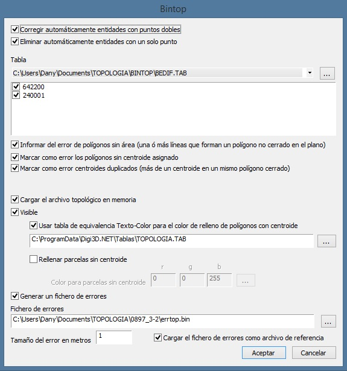

# BINTOP

1. Crea un fichero topológico: Este fichero tendrá de extensión TOP y en él se van a almacenar las relaciones topológicas entre las entidades. Este fichero es de tipo binario y su estructura no es accesible por el usuario. Con el programa _TOPASC_ se puede transformar el fichero TOP en un fichero ASCII que puede ser visualizado con un editor de texto o cargado en una base de datos.

   El fichero topológico sólo tiene validez para un fichero de dibujo en un momento dado. si se modifica el fichero de dibujo con las órdenes de edición de _DigiNG_, el fichero topológico no podrá encontrar los [tramos]() ni los [centroides]() para formar polígonos. Por defecto este fichero se guardará con el nombre de la tabla de códigos y extensión TOP.

2. Busca errores en la formación de dichas relaciones. Estos errores serán:
   * Polígonos sin área.
   * Polígonos sin centroide.
   * Polígonos con más de un centroide.

## Parámetros

Al ejecutar la orden aparecerá el siguiente cuadro de diálogo:

* Casillas correspondientes a los **errores a detectar**:
  * Informar del error de polígonos sin área \(una o más líneas que forman un polígono no cerrado en el plano\)
  * Marcar como error los polígonos sin centroide asignado
  * Marcar como error centroides duplicados \(más de un centroide en un mismo polígono cerrado\)
* **Tabla**: Es un fichero de texto en el que se listan los códigos de las entidades que se van a tratar en este programa. Los códigos de las entidades que forman los [tramos]() y los códigos de los textos que forman los [centroides]().

  Cada código se escribirá en una línea del fichero y perfectamente justificado a la izquierda. Las letras mayúsculas y minúsculas son interpretadas por _Digi3D.NET_ como códigos diferentes. Se pueden usar caracteres comodín "\*" y "?" como parte de un código, para hacer referencia a un grupo de ellos, sin necesidad de tener que listarlos uno a uno.

  **Ejemplo:**

  1401\* se refiere a todos los códigos que empiecen por 1401 sean cual sean sus dos últimos caracteres

  El programa buscará inicialmente un fichero denominado BINTOP.TAB en el directorio del programa. Si no lo encuentra, lo advierte y posteriormente se deberá seleccionar el fichero apropiado. Por defecto se buscarán ficheros con extensión TAB, aunque puede utilizarse cualquier otra. En este caso hay que optar por **Todos los archivos** en la casilla Archivos de tipo para poder realizar la selección del fichero.

  La tabla de códigos puede ser modificada desde el programa utilizando el botón Editar.

* **Cargar el archivo topológico en memoria**: Permite al usuario cargar en memoria el fichero topológico que mostrará los rellenos de los polígonos.
* **Visible**: Esta opción se refiere a la visibilidad de los rellenos de áreas. Al marcar esta opción de Visible se rellenarán las áreas cerradas que contienen centroide.
* **Usar tabla de equivalencia Texto-Color para el color de relleno de polígonos con centroide**: Podrás marcar esta casilla de manera que se permite la selección de la tabla de equivalencia entre centroide y color.

  Esta tabla de equivalencia tendrá extensión TAB y su formato será el siguiente:

  nombre\_centroide componente\_rojo componente\_verde componente\_azul

* **Rellenar parcelas sin centroide**: Si has marcado la casilla de Visible, se habilita esta opción de Rellenar parcelas sin centroide. Una vez habilitada la opción, se podrá marcar la casilla para indicar las áreas sin centroide mediante este relleno.
* **Color para parcelas sin centroide**: Aquí podrás especificar el color para el relleno de parcelas sin centroide, mediante los componentes de rojo \(r\), verde \(g\) y azul \(b\). Por defecto después de ejecutar Bintop, las áreas sin centroide aparecerán con relleno azul.
* **Generar un fichero de errores**: si está activada esta opción se generará un archivo de errores en la ubicación y con el nombre que se especifique.
* **Fichero de errores**: Nombre del fichero que se va a crear con las marcas de error. Si existe el fichero, se borra y se crea de nuevo. Es un fichero con formtao BIN y puede ser visualizado con DigiNG escribiendo su nombre en la pantalla de entrada. También puede ser cargado como fichero de referencia, con la orden [CARGA\_F](CARGA_F.html), sobre el fichero de dibujo que contiene las entidades. Las órdenes [ERR](ERR.html), [ERR+](ERR+.html) y [ERR-](ERR-.html), nos llevarán a cada error para visualizarlo y poder corregirlo con las funciones de edición.
* **Tamaño del error en metros**: Se dará el valor en metros \(unidades terreno\), para que su tamaño sea adecuado al localizar el error. Las marcas de error son cuadrados con un ángulo en uno de sus lados, de manera que las coordenadas del vértice sean las mismas que las del punto dónde esta el error.
* **Cargar el fichero de errores como archivo de referencia**: en caso de marcar esta casilla se cargará automáticamente el fichero con los símbolos de error como fichero de referencia, esto permitirá al usuario el control y la correción de los errores inmediatamente.

## Observaciones

El primer proceso que realiza BINTOP es la detección de errores graves de [topología](), éstos errores son:

* Puntos dobles al comienzo de una línea
* Líneas compuestas de un sólo punto

Estos errores se marcarán en el fichero de errores, que se podrá cargar como referencia, y su tamaño podrá ser definido por el usuario.

En caso de que en el fichero de dibujo existan errores de este tipo, la información correspondiente se mostrará en la Ventana de tareas.

Puedes ir al error deseado haciendo doble clic sobre el campo correspondiente al error en la ventana de tareas.

Una vez corregido el error, lo podrás marcar en la casilla situada a la izquierda del campo para saber en cualquier momento que error se ha corregido.

En caso de encontrar errores relacionados con polígonos el programa marcará estos, mediante un relleno y los mostrará en la ventana de tareas.

### Puedes ejecutar la orden BINTOP desde la línea de comandos:

BINTOP=\[tabla\] \[polígonos\_sin\_area\] \[polígonos\_sin\_centroide\] \[centroides\_duplicados\] \[generar\_archivo\_errores\]1\] \[cargar\_topológico\_en\_memoria\*2\]

* \[tabla\]: el primer parámetro a especificar es el directorio completo y nombre de la tabla de códigos.
* \[polígonos\_sin\_area\]: en caso de querer marcar los polígonos sin area se pondrá aquí el valor 1 \(verdadero\) en caso contrario se pondrá un 0 \(falso\).
* \[polígonos\_sin\_centroide\]: en caso de querer marcar polígonos sin centroide se pondrá el valor 1 \(verdadero\)
* \[centroides\_duplicados\]: en caso de querer que el programa marque como error los centroides duplicados se podnrá aquí el valor 1.
* \[generar\_archivo\_errores\*1\]: si se desea generar un archivo de errores se necesitan especificar a continuación los siguientes parámetros:
  * \[nombre\_fichero\_de\_errores\]: aquí se deberá especificar el directorio completo y nombre del fichero con los símbolos de rror.
  * \[tamaño\_de\_error\]: este es el tamaño de lo símbolos de error en metros.
  * \[cargar\_como\_referencia\]: en caso de querer cargar el archivo automáticamente como referencia se deberá poner aquí un 1, en caso contrario se escribirá un 0.
* \[cargar\_topológico\_en\_memoria\*2\]: en caso de querer cargar el archivo topológico en memoria se escribirá un 1 y se deberán especificar los siguientes parámetros:
  * \[visible\]: para activar la visibilidad de los rellenos de área se deberá escribir un 1.
* \[usar\_tabla\_colores\*4\]: aquí se especifica el directorio completo y nombre de la tabla de corrspondencia texto\_código para los polígonos con centroide.
* \[directorio\_nombre\_tabla\_colores\]: aquí se especifica el dirctorio completo y nombre del archivo de equivalencia de colores y centroides.
* \[rellenar\_polígonos\_sin\_centroide\*5\]: para rellenar polígonos sin centroide se pondrá el valor 1.
  * \[colorR\]: componente del color rojo para el código de relleno
  * \[colorG\]: componente del color verde para el código de relleno
  * \[colorB\]: componente del color azul para el código de relleno

### Ejemplos de ejecución de BINTOP por la línea de comandos:

`bintop="c:\tabla1.tab" 1 0 0 0 1 1 1 "C:\color.tab" 1 255 127 32`

1. Hace topología con la tabla c:\tabla1
2. Marca polígonos sin área
3. No marcará polígonos sin centroide
4. No marcará centroides duplicados
5. No genera fichero de errores, muestra una descripción del error en la barra resultados
6. Carga la topología en memoria
7. Hará visibles mediante relleno a los polígonos sin área
8. Utiliza tabla de equivalencia entre centroides y colores de relleno
9. Directorio completo y nombre de la tabla de equivalencia de centroide-color
10. Rellena polígonos sin centroide
11. La componente del color rojo para el relleno de polígonos sin centroide 255
12. La componente del color verde para el relleno de polígonos sin centroide 127
13. La componente del color azul para el relleno de polígonos sin centroide 32

`bintop="c:\tabla1.tab" 1 1 1 1 "c:\err.bin" 2 1 1 1 1 "C:\color.tab" 1 255 127 32`

1. Hace topología con la tabla c:\tabla1
2. Marca polígonos sin área
3. Marca polígonos sin centroide
4. Marca centroides duplicados
5. Generando un fichero de errores
6. El fichero será c:\err.bin
7. Con errores con un tamaño de 2 metros
8. Cargando el fichero de errores como referencia
9. Carga la topología en memoria
10. Hará visibles mediante relleno a los polígonos sin área
11. Utiliza tabla de equivalencia entre centroides y colores de relleno
12. Directorio completo y nombre de la tabla de equivalencia de centroide-color
13. Rellena polígonos sin centroide
14. La componente del color rojo para el relleno de polígonos sin centroide 255
15. La componente del color verde para el relleno de polígonos sin centroide 127
16. La componente del color azul para el relleno de polígonos sin centroide 32

## Características de la orden

| Tipo de orden | [Orden interactiva]() |
| :--- | :--- |
| Repite automáticamente | No |
| Opción del menú donde aparece la orden | _Esta orden no tiene asociada ninguna opción de menú_ |
| Barra de herramientas en la que aparece la orden | _Esta orden no tiene asociado ningún botón en ninguna barra de herramientas_ |
| Extensión | DigiNG.OrdenesStandard.dll |
| Variables relacionadas | No tiene variables relacionadas |

