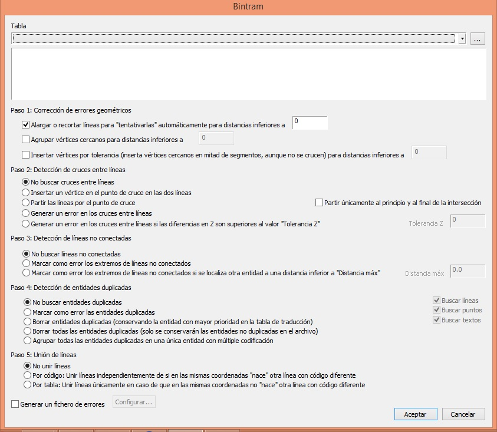

# BINTRAM

Automatiza la edición del archivo de dibujo.

## Parámetros

Va a permitir al usuario:

- Corregir automáticamente errores en intersecciones y líneas no conectadas

- Detectar cruces entre líneas revisando la tolerancia en Z

- Tramificar entidades

- Detectar entidades duplicadas

- Juntar entidades para eliminar nodos superfluos

Al ejecutar la orden aparecerá el siguiente cuadro de diálogo:

* Lo primero que deberás hacer es seleccionar la Tabla de códigos que utilizará en el proceso. Esta tabla es un archivo de texto en el que listan los códigos de las entidades que se van a tratar en esta orden. Cada código se escribirá en una línea del fichero y perfectamente justificado a la izquierda. Las letras mayúsculas y las minúsculas son interpretadas por Digi3D.NET como códigos diferentes. Se pueden usar el comodín "\*" como parte de un código, para hacer referencia a un grupo de ellos, sin necesidad de tener que listarlos uno a uno. Por ejemplo: 1401\* se refiere a todos los códigos que empiecen por 1401 sean cual sean sus dos últimos caracteres. Por defecto se buscarán ficheros con extensión TAB, aunque puede utilizarse cualquier otra. En este caso hay que optar por Todos los archivos en la casilla Archivos de tipo para poder realizar la selección del fichero. Una vez seleccionada la tabla aparecerán listados los códigos en el campo correspondiente junto a una casilla para su activación o desactivación.

A continuación se explican los diferentes pasos y opciones del proceso BINTRAM.

* Paso 1: Corregir errores automáticamente

Alargar o recortar líneas para "tentativarlas" automáticamente para distancias inferiores a ...

Al marcar esta casilla el usuario podrá corregir los errores de líneas no conectadas o líneas que se sobrepasan. En este caso el programa buscará líneas que se encuentren cerca de otras a distancias menores a la tolerancia mostrada, en ese caso se alargarán hasta engancharse correctamente a la otra entidad. En caso de que la línea sobrepase a otra en una distancia menor a la especificada también se recortará el segmento sobrante.

* Paso 2: Detección de cruces entre líneas

  
Aquí el usuario puede seleccionar una de las siguientes opciones:

- No buscar cruces entre líneas

- Insertar un vértice en el punto de cruce en las dos líneas

- Partir las líneas por un punto de cruce

- Generar un error en los cruces entre líneas

- Generar un error en los cruces entre líneas si las diferencias en Z son superiores al valor "ToleranciaZ": al marcar esta opción se habilitará el parámetro de Tolerancia Z, para que el usuario pueda especificar este valor.

* Paso 3: Detección de líneas no conectadas

Opciones:

- No buscar líneas conectadas

- Marcar como error los extremos de líneas no conectados

- Marcar como error los extremos de líneas no conectadas si se localiza otra entidad a una distancia inferior a "Distancia máx"

* Paso 4: Detección de entidades duplicadas

Opciones:

- No buscar entidades duplicadas

- Marcar como error las entidades duplicadas

- Borrar entidades duplicadas

En la parte derecha se puede especificar que tipo de entidades buscar líneas, puntos o textos.

* Paso 5: Unión de líneas

- No unir líneas

- Unir líneas independientemente de si en las mismas coordenadas "nace" otra línea con código diferente

- Unir líneas únicamente en caso de que en las mismas coordenadas no "nace" otra línea con código diferente.

Generar un fichero de errores:

Bintram genera por defecto un archivo de extensión .bin que se cargará como fichero de referencia una vez terminado el proceso. En este archivo aparecerán los símbolos que señalarán los errores.

Si se pulsa sobre Configurar aparece la siguiente ventana en la cual se podrá especificar la dirección y nombre del archivo de errores:

  
Por defecto esta marcada la casilla de Cargar el fichero de errores como fichero de referencia y Eliminar el archivo de errores si ya existe.

En el lado derecho parecerán los códigos de los símbolos de error que se van a generar, cada tipo de error podrá tener otro código para una mejor diferenciación. También se puede especificar el tamaño del error en metros.

## Observaciones

  
Resultados del proceso BINTRAM:

La orden BINTRAM ayudará al usuario a detectar y corregir errores mediante el archivo de errores de formato BIN y la salida de resultados en la [Ventana de Tareas](VentanaTareas.html) y la [Ventana de Resultados](VentanaResultados.html).

Ventana de Tareas:

  
En la columna Descripción se informa al usuario del tipo de error, por ejemplo: Intersección de líneas, Error de Extremos o Línea duplicada...

En la columna de Información de la entidad se explica el error en concreto. El usuario podrá hacer doble clic en los campos de error de esta ventana para que el cursor le lleve automáticamente al error correspondiente para corregirlo. También es posible el marcar entonces la casilla situada a la izquierda del campo para llevar un control de los errores corregidos y por corregir.

  
Ventana de Resultados:

La tabla de códigos con la que se ha hecho el proceso y el número de errores de Intersecciones, Extremos y duplicados.

  
  
DigiNG también ofrece la posibilidad de ejecutar esta orden especificando sus parámetros en la ventana de órdenes. En este caso los parámetros se pasarían al programa de la siguiente forma:

BINTRAM=\[tabla\] \[generar archivo de errores \*1\] \[corregir errores autom \*2\] \[detectar\_intersecciones \*3\] \[detectar\_lineas\_no\_conectadas \*4\] \[detección de entidades duplicadas \*5\] \[unión de líneas \*6\]

* \["tabla"\], el usuario deberá especificar entre comillas el directorio y nombre con extensión de la tabla de códigos a utilizar en el proceso.
* \[generar un fichero de error \*1\]. En caso de querer generar este fichero de error se pondrá un 1 como parámetro y en caso de no querer generarlo se pondrá un 0.

\*1 Si verdadero, aparecen muchos parámetros que son:

  
\[path al archivo de errores\] \[truncar\] \[tamaño del error\] \[cod error interseccion\] \[cod error extremos\] \[cod error duplicados\] \[cargar archivo referencia\]

* \[corregir errores autom \*2\]: En caso de querer corregir líneas que no están conectadas y líneas que se sobrepasan se pondrá un 1 como verdadero

\*2 Si Verdadero, aparece el parámetro \[tolerancia\_minima\]

* \[detectar\_intersecciones \*3\]

\*3 Valores:

   0 = No

   1= Insertar vértice

   2 = partir

   3 = generar error

   4 = generar error si tolerancia máxima. Aparece un parámetro más que es \[tolerancia\_Z\]

* \[detectar\_lineas\_no\_conectadas \*4\]

\*4 Valores:

   0 = no

   1 = Marcar como error

   2 = Marcar como error con tolerancia máxima. Aparece el parámetro \[tolerancia\_maxima\]

* \[detección de entidades duplicadas \*5\]

\*5 Valores:

   0 = No

   1 = Marcar como error

   2 = Borrar

  Si el valor es 1 ó 2 aparecen los parámetros \[buscar\_lineas\] \[buscar\_puntos\] \[buscar\_textos\]

* \[unión de líneas \*6\]

\*6 Valores:

   0 = No

   1 = Unir líneas independientemente de si en el mismo vértice nace otra con otro código

   2 = Unir líneas si NO nace en el mismo vértice otra con otro código

### Ejemplo de ejecución de BINTRAM por línea de comandos:

  
`BINTRAM="C:\ASTE.tab" 1 "C:\err.bin" 1 2 cod1 cod2 cod3 1 1 0.3 4 0.2 1 0.5 1 1 1 1 1`

Este ejemplo hará lo siguiente:

1. Utiliza la tabla de códigos ASTE que se encuentra en el directorio C:\ASTE.tab
2. Va a generar un archivo de error
3. El archivo de error generado será el siguiente:C:\err.bin
4. Va a sobreescribir el archivo de error que hubiera previamente con el mismo nombre en el mismo directorio
5. El tamaño en metros de los errores será m
6. El código para marcar errores de intersección será cod1
7. El código para marcar los errores de extremos será cod2
8. El código para marcar entidades duplicadas será cod3
9. El archivo de error generado se cargará automáticamente como fichero de referencia
10. Se corregirán errores automáticamente
11. Estos errores se corregirán dependiendo de la tolerancia, que en este caso es 0.3
12. Se generará un símbolo de error en la intersecciones que no cumplen con la tolerancia en Z
13. La tolerancia en Z de intersecciones será 0.2
14. Se detectarán líneas que están cercanas pero no conectadas
15. La tolerancia para líneas conectadas será de 0.5
16. Se marcarán entidades duplicadas
17. Se marcarán líneas duplicadas
18. Se marcarán puntos duplicados
19. Se marcarán textos duplicados
20. Se unirán líneas independientemente de si en el mismo vértice nace otra con otro código

## Características de la orden

| Tipo de orden | [Orden interactiva]() |
| :--- | :--- |
| Repite automáticamente | No |
| Opción del menú donde aparece la orden | _Esta orden no tiene asociada ninguna opción de menú_ |
| Barra de herramientas en la que aparece la orden | _Esta orden no tiene asociado ningún botón en ninguna barra de herramientas_ |
| Extensión | DigiNG.OrdenesStandard.dll |
| Variables relacionadas | No tiene variables relacionadas |

