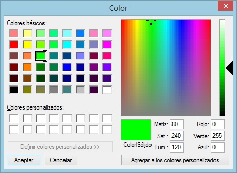

# COLOR\_INDICE

Permite cambiar el color de los índices en la pantalla estereoscópica.

## Parámetros

Esta orden no admite parámetros.

## Observaciones

Al ejecutar la orden aparecerá la siguiente ventana en la cual el usuario podrá seleccionar el color:

Puedes ejecutar esta orden desde la línea de comandos, especificando las componentes del color RGB.

### Ejemplo

`COLOR_INDICE=0 255 0`

## Características de la orden

| Tipo de orden |  |
| :--- | :--- |
| Repite automáticamente |  |
| Opción del menú donde aparece la orden |  |
| Barra de herramientas en la que aparece la orden |  |
| Extensión |  |
| Variables relacionadas |  |

