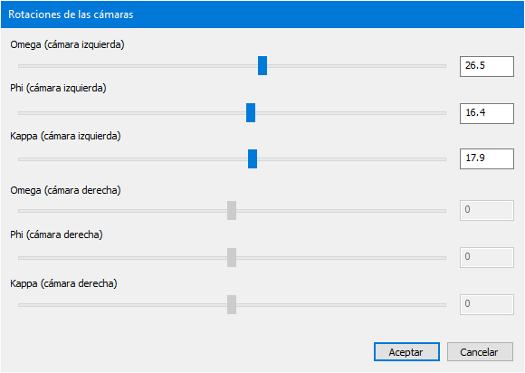

# ROTACIONES\_CAMARAS

Permite cambiar la rotación visualización de las imágenes en la ventana fotogramétrica.

## Parámetros

Esta orden no admite parámetros

## Observaciones

Esta orden te va a permitir cambiar dinámicamente los ángulos _Omega_, _Phi_ y _Kappa_ con los que se visualizan las imágenes en la ventana fotogramétrica.

  
Puedes utilizar los deslizadores para cambiar los ángulos o asignar valores tecleándolos en los cuadros que aparece a la derecha de cada deslizador.

  
Si aceptas el cuadro de diálogo, se mantendrán los ajustes que has realizado. Si cancelas, se volverá a asignar a las imágenes los ajustes que tuvieran antes de ejecutar la orden.

  
Digi3D.NET memorizará \(almacenando en el archivo .D3D asociado a cada modelo\) los valores de los ángulos, de manera que la próxima vez que cargues ese modelo en particular, las imágenes mantendrán la rotación.

  
Si el modelo cargado es monoscópico, los deslizadores de la cámara derecha aparecerán deshabilitados, y los ángulos de rotación de la única imagen se modificarán mediante los controles para la cámara izquierda.

## Características de la orden

| Tipo de orden | Interactiva |
| :--- | :--- |
| Repite automáticamente | No |
| Opción del menú donde aparece la orden | Ventana fotogramétrica/Transformación de las imágenes/Rotaciones de las cámaras... |
| Barra de herramientas en la que aparece la orden | Esta orden no aparece en ninguna barra de herramientas |
| Extensión | Digi3D.CommonCommands.dll |
| Nombre interno de la orden | {C96276F0-D517-4AAB-A662-4A7FEC6BCFA8} |
| Variables relacionadas | Esta orden no se ve afectada por ninguna variable. |

