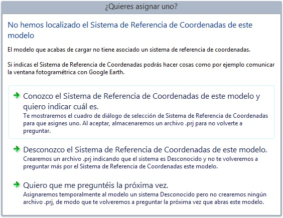

# Asignacion del Sistema de Referencia de Coordenadas a un archivo de dibujo

Hasta ahora, si cargábamos un proyecto que no proporcionaba Sistema de Referencia de Coordenadas, Digi3D.NET asignaba de forma automática a los modelos cargados un Sistema Local (desconocido).

Si conoces el sistema en el que están las orientaciones del proyecto y quieres asignarlo (para por ejemplo conectarnos con Google Earth), tenías que crear un archivo .prj con el mismo nombre que el archivo de aerotriangulación y especificar el Sistema de Referencia de Coordenadas adecuado.

Debido a que este proceso no era muy intuitivo, lo hemos mejorado.\
Ahora al cargar un modelo, si se detecta que éste no tiene asociado un SRC el programa va a mostrar el siguiente cuadro de diálogo:

Este cuadro de diálogo es completamente auto-explicativo y realizará las acciones por nosotros.

## Vídeo

Puedes ver esta funcionalidad en acción en el suiente enlace [https://youtu.be/2IB5l2D2nNc](https://youtu.be/2IB5l2D2nNc)
