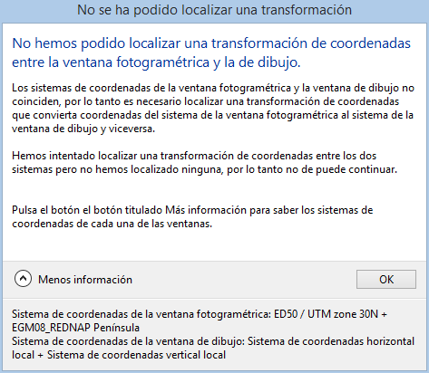

# Sistema de Referencia de Coordenadas Desconocido

En ocasiones desconocemos el sistema de coordenadas en el que están las coordenadas de un archivo (archivo de aerotriangulación, archivo de puntos de apoyo, archivo de dibujo,...)

Si desconocemos el sistema de coordenadas de un archivo, cuando Digi3D.NET nos pregunte por dicho sistema de coordenadas, tendremos que indicar que éste es deconocido.

Los sistemas desconocidos tienen el inconveniente de que al ser desconocidos **no se puede** realizar ninguna **transformación de coordenadas** de un sistema de coordenadas **conocido a** uno **desconocido ni viceversa,** lo que significa que si tenemos cargado por ejemplo un modelo fotogramétrico en un sistema de coordenadas conocido, por ejemplo _ED 50 / UTM Zone 30N + EGM2008 Rednap península_, e intentamos cargar un archivo de dibujo con sistemas de referencia de coordenadas desconocido, Digi3D.NET mostrará el siguiente cuadro de error indicando que no sabe cómo transformar las coordenadas de la ventana fotogramétrica a la de la ventana de dibujo, porque una de ellas (en este caso la de la ventana de dibujo) es desconocida, obviamente no sabe cómo transformar entre algo conocido a algo desconocido (cuyas unidades podrían ser metros, pies, millas, micras,... no se sabe):

## Vídeo

<video controls><source src="https://digi21.blob.core.windows.net/videos-ayuda/SCR%20de%20la%20ventana%20foto%20conocido%20y%20de%20la%20ventana%20de%20dibujo%20desconocido.mp4" type="video/mp4"></video>
