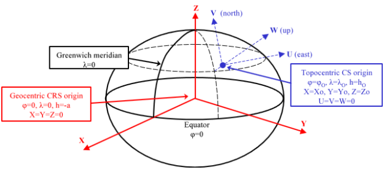

# Sistemas de Referencia de Coordenadas Topocéntricos

Son sistemas de coordenadas cartesianos tangentes al elipsoide \(o esferoide\) en un determinado punto y con los ejes orientados de manera que el eje de la _X_ crece hacia el _este_, el de la _Y_ hacia el norte y el de la _Z_ es perpendicular creciendo según se aleja del centro del elipsoide \(o esferoide\). Es el representado en color azul en la imagen de arriba.

Al igual que en los [Sistemas de Referencia de Coordenadas Geocéntricos](/digi3d-net/sistemas-referencia-coordenadas/introduccion-sistemas-referencia-coordenadas/tipos-sistemas-referencia-coordenadas/sistemas-referencia-coordenadas-horizontales/sistemas-referencia-coordenadas-geocentricos.md), Digi3D.NET debe crear un sistema de referencia de coordenadas topocéntrico, pero no permite al usuario seleccionar como sistema de coordenadas un sistema de coordenadas de este tipo.

