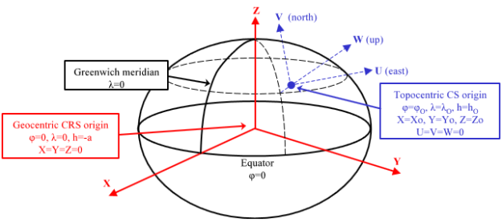

# Sistemas de Referencia de Coordenadas Geocéntricos

Digi3D.NET en ocasiones debe transformar coordenadas de un determinado sistema de coordenadas determinado a un sistema de coordenadas geocéntrico.

Los sistemas de coordenadas geocéntricos son siempre sistemas de coordenadas cartesianos, con origen en el centro del de la tierra y sus unidades son siempre metros.

Digi3D.NET no te va a permitir seleccionar como sistema de referencia de coordenadas uno geocéntrico, pero internamente lo va a utilizar \(por ejemplo al calcular orientaciones absolutas, el cálculo en ocasiones se realiza en coordenadas geocéntricas\).

En la imagen anterior, el sistema geocéntrico es el representado con color rojo.

