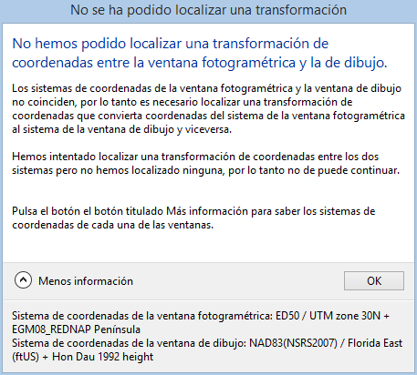

# Localización de transformaciones entre distintos sistemas de referencia de coordenadas

Digi3D.NET en ocasiones tiene que transformar coordenadas entre distintos sistemas de referencia de coordenadas. Para poder realizar esta operación, necesita localizar una _transformación matemática_ entre ambos sistemas.

La base de datos _EPSG_ incluye una lista de las posibles transformaciones matemáticas existentes entre dos sistemas de referencia de coordenadas.

Digi3D.NET consulta a la base de datos _EPSG_ siempre que precisa localizar una transformación entre dos sistemas de referencia de coordenadas. Si encuentra una transformación, utilizará esta transformación para transformar entre ambos sistemas de referencia de coordenadas.

Las transformaciones especificadas en la base de datos _EPSG_ son siempre entre

1. Sistemas horizontales 2D y sistemas horizontales 2D.
2. Sistemas horizontales 3D y sistemas horizontales 3D.
3. Sistemas horizontales 3D y sistemas verticales.
4. Sistemas verticales y sistemas verticales.

No existe ninguna transformación de coordenadas de referencia entre sistemas compuestos (que son la mayoría que vamos a utilizar con Digi3D.NET), pero Digi3D.NET se encarga de localizar correctamente las transformaciones entre sistemas compuestos y horizontales y verticales de forma transparente para el usuario.

Si uno de los dos sistemas es compuesto, como por ejemplo _ED50 / UTM Zone 30N + EGM06_ se localizará la transformación horizontal por un lado y vertical por otro realizando una serie de operaciones de concatenación que encapsulan ambas transformaciones en una única transformación.

No existen transformaciones entre todos los sistemas de referencia de coordenadas. Por ejemplo, no existe ninguna transformación entre los sistemas de coordenadas horizontales _ED50 / UTM Zone 30N y NAD83(NSR2007) / Florida East (ftUS)._

Digi3D.NET es muy restrictivo a la hora de localizar transformaciones entre sistemas de referencia de coordenadas horizontales. Si no se localiza una transformación entre sistemas horizontales se mostrará un mensaje de error al usuario, sin embargo es menos restrictivo a la hora de localizar transformaciones verticales, permitiendo al usuario especificar una transformación genérica en caso de no localizar una transformación vertical.

Cuando Digi3D.NET intenta localizar una transformación entre dos sistemas pueden darse tres posibilidades:

1.  Que se localice una única transformación entre ambos sistemas.

    En este caso, Digi3D.NET utilizará dicha transformación sin preguntarle nada al usuario. La transformación se asignará de forma transparente para el usuario.
2.  Que no se localice ninguna transformación entre ambos sistemas.

    Si se está intentando localizar una transformación horizontal:

    En este caso Digi3D.NET le comunicará al usuario la imposibilidad de localizar una transformación mediante un cuadro de diálogo mostrando toda la información posible para que el usuario sepa cual es el problema. Generalmente esto cancela la operación que se estaba realizando, por ejemplo, la siguiente captura de pantalla se muestra al intentar abrir una ventana de dibujo con un sistema incompatible con el de la ventana fotogramétrica (que ya está abierta). Una vez aceptado el cuadro de diálogo por parte del usuario se cancelará la creación de la ventana de dibujo.

    Si por el contrario se estaba intentando localizar una transformación vertical, se mostrará al usuario el **cuadro de diálogo Selección de Transformación Vertical**

    
3.  Que se localicen varias transformaciones entre ambos sistemas.

    En este caso Digi3D.NET mostrará al usuario el **Cuadro de diálogo Localizadas Múltiples Transformaciones**.
