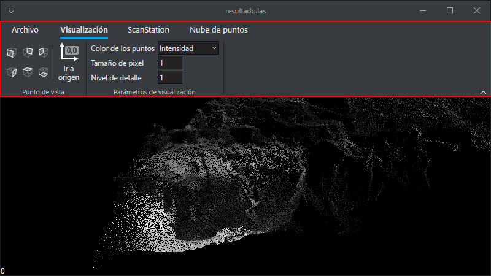

# Interfaz de usuario

El programa dispone de una barra de herramientas denominada Ribbon que permite interactuar con el programa.

Al pulsar en cada una de las pestañas el ribbon muestra una serie de ventanas relacionadas con dicha pestaña. En el ejemplo anterior podemos ver que está seleccionada la pestaña Visualización y el programa está mostrando todas las herramientas relacionadas con visualización.

Dispone de las siguientes pestañas:

* [Archivo](/lot-of-points-cc/interfaz-de-usuario/archivo/).
* [Visualización](/lot-of-points-cc/interfaz-de-usuario/visualizacion/).
* [ScanStation](/lot-of-points-cc/interfaz-de-usuario/scanstation/).
* [Nube de puntos](/lot-of-points-cc/interfaz-de-usuario/nube-de-puntos/).
