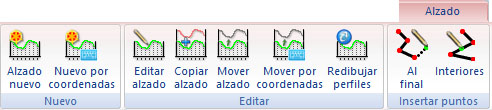

# Ficha de herramientas Alzado

[Cinta de herramientas](../untitled-12/)

En esta ficha de herramientas se agrupan las principales herramientas utilizadas con el registro de los alzados \(diseño vertical\) de viales. Por tanto, para ser mostrada se debe tener activa la vista Alzado del actual documento de viales. Cada trazado puede tener tantos alzados como se desee. Además, podrá tener el alzado obtenido de su proyección sobre un MDT. Su aspecto es el siguiente:

En esta ficha de herramientas aparecen los siguientes comandos:

* Alzado nuevo: Permite crear un alzado nuevo. Para ello, el usuario deberá indicar en pantalla con el botón izquierdo del ratón aquellos puntos que conforman el estado de alineaciones del nuevo alzado. Una vez que se haya terminado, se deberá pulsar el botón derecho del ratón, mostrando el programa un [cuadro de diálogo ](../untitled-288/alzado/untitled-53/)donde se muestran los puntos registrados, junto a otras características del nuevo alzado.
* Nuevo por coordenadas: : Al igual que la opción anterior, permite crear un alzado nuevo, pero mostrando directamente el [cuadro de diálogo](Cuadro%20de%20dialogo%20Calcular%20Alzado%20Nuevo.htm) para añadir puntos conociendo sus coordenadas
* Editar alzado: Permite editar gráficamente un alzado existente. Para ello se deberá seleccionar con el botón izquierdo del ratón el alzado que se desea editar. Una vez seleccionado, se podrán mover los puntos, pulsando con el botón izquierdo del ratón sobre ellos y arrastrando. Si no se selecciona el elemento deseado al pulsar con el botón izquierdo, se puede pulsar el botón derecho del ratón y el programa buscará otra entidad en la misma localización.
* Copiar alzado: Permite copiar un alzado existente. Para ello seleccione con el botón izquierdo del ratón el alzado que desea copiar. Una vez seleccionado el alzado deseado acepte nuevamente con el botón izquierdo del ratón. Si no se seleccionó el alzado deseado, pulse el botón derecho del ratón para que el programa siga buscando en la misma localización hasta encontrar el deseado. Una vez aceptado, el programa mostrará el [cuadro de diálogo ](../untitled-288/alzado/untitled-53/)de información del alzado.
* Mover alzado: Permite mover un alzado existente. Para ello seleccione con el botón izquierdo del ratón el alzado que desea copiar. Una vez seleccionado el alzado deseado mueva el ratón sin soltar el botón izquierdo hasta la nueva localización. Si no se seleccionó el alzado deseado, pulse el botón derecho del ratón para que el programa siga buscando en la misma localización hasta encontrar el deseado.
* Mover alzado por coordenadas: Permite mover un alzado existente indicando con el teclado el desplazamiento. Para ello seleccione con el botón izquierdo del ratón el alzado que desea copiar. Una vez seleccionado el alzado, el programa muestra un cuadro de diálogo donde se podrá especificar el desplazamiento en X e Y. Si no se seleccionó el alzado deseado, pulse el botón derecho del ratón para que el programa siga buscando en la misma localización hasta encontrar el deseado.
* Redibujar perfiles: Este comando permite regenerar la vista que contiene los alzados. Es útil cuando se han estado editando gráficamente los perfiles y se han movido algunos de ellos, descolocándose respecto del orden inicial. El programa únicamente vuelve a calcular las guitarras y las vuelve a pintar en pantalla.
* Añadir vértice al final: Con este comando el programa permite incorporar vértices nuevos al alzado por alguno de sus extremos. Para ello el programa pedirá que se seleccione con el botón izquierdo del ratón el alzado que se desea modificar. Si al pulsar con el botón izquierdo no se selecciona el alzado deseado, se puede pulsar el botón derecho para seguir buscando alzados en la misma ubicación. Se deberá pulsar otra vez el botón izquierdo para aceptar la selección. Una vez hecho esto, el programa esperará a que el usuario empiece a registrar los vértices añadiéndolos por el extremo más próximo. Para terminar de registrar vértices se deberá pulsar el botón derecho del ratón, apareciendo un [cuadro de diálogo ](../untitled-288/alzado/untitled-53/)con las características del alzado. Si durante la edición se pulsa el botón ESC, ésta se cancelará.
* Añadir vértice en el interior: Con este comando el programa permite incorporar vértices nuevos al alzado en el interior de éste. Para ello el programa pedirá que se seleccione con el botón izquierdo del ratón el alzado que se desea modificar. Si al pulsar con el botón izquierdo no se selecciona el alzado deseado, se puede pulsar el botón derecho para seguir buscando alzados en la misma ubicación. Se deberá pulsar otra vez el botón izquierdo para aceptar la selección. Una vez hecho esto, el programa esperará a que el usuario empiece a registrar los vértices. Estos vértices deberán estar en las proximidades del alzado.

