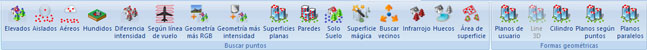

# Ficha de herramientas Clasificar LiDAR

[Cinta de herramientas](../untitled-12/)

En esta ficha de herramientas aparecen los comandos relacionados con la clasificación de puntos LiDAR medidos con dispositivos láser aerotransportados del [módulo láser](../untitled-285/).

* [Elevados](../untitled-285/buscar-puntos/untitled-41.md): Herramienta destinada a la búsqueda y clasificación de puntos LiDAR en función de las propiedades geométricas que un punto tiene con su entorno
* [Aislados](../untitled-285/buscar-puntos/untitled-39.md): Herramienta destinada a la búsqueda y clasificación de puntos LiDAR que se encuentren aislados, no encontrándose ningún punto cerca de su entorno, normalmente porque estos puntos tienen un valor de cota erróneo
* [Aéreos](../untitled-285/buscar-puntos/untitled-38.md): Herramienta destinada a la búsqueda y clasificación de puntos LiDAR que tienen una cota mucho más elevado que los puntos de su entorno, normalmente porque el valor de esta cota es erróneo
* [Hundidos](../untitled-285/buscar-puntos/untitled-44.md): Herramienta destinada a la búsqueda y clasificación de puntos LiDAR que tienen una cota mucho más bajo que los puntos de su entorno, normalmente porque el valor de esta cota es erróneo
* [Diferencia intensidad](../untitled-285/buscar-puntos/untitled-40.md): Herramienta destinada a la búsqueda y clasificación de puntos LiDAR en función de las diferencias entre los valores de intensidad que un punto tiene con su entorno
* [Según línea de vuelo](../untitled-285/buscar-puntos/untitled-49.md): Herramienta destinada a la búsqueda y clasificación de puntos LiDAR en función de las propiedades geométricas que un punto tiene con los puntos registrados antes o después en el vuelo
* [Geometría más RGB ](../untitled-285/buscar-puntos/untitled-47.md): Herramienta destinada a la búsqueda y clasificación de puntos LiDAR en función de las propiedades geométricas que un punto tiene con su entorno más el valor del color que tenga asignado
* [Geometría más intensidad ](../untitled-285/buscar-puntos/untitled-46.md): Herramienta destinada a la búsqueda y clasificación de puntos LiDAR en función de las propiedades geométricas que un punto tiene con su entorno más el valor de la intensidad que tenga asignado
* [Superficies planas](../untitled-285/buscar-puntos/untitled-43.md): Herramienta destinada a la búsqueda y clasificación de puntos LiDAR que están situados en superficies planas con una inclinación máxima y una superficie mínima. Es decir, es muy indicada para la búsqueda de puntos que se han medido sobre las cubiertas de los edificios
* [Paredes](../untitled-285/buscar-puntos/untitled-42.md): Herramienta destinada a la búsqueda y clasificación de puntos LiDAR que están situados en superficies verticales, como pueden ser las fachadas de los edificios
* [Solo Suelo](../untitled-285/buscar-puntos/untitled-198.md): Herramienta para la búsqueda rápida de puntos pertenecientes al suelo.
* [Superficie mágica](../untitled-285/buscar-puntos/untitled-201/): Herramienta destinada a la búsqueda y clasificación de puntos LiDAR de forma automática, combinando diversos algoritmos y herramientas de búsqueda.
* [Buscar vecinos](../untitled-285/buscar-puntos/untitled-51.md): Herramienta destinada a la búsqueda de puntos vecinos según clasificación.
* [Infrarrojo](../untitled-285/buscar-puntos/untitled-48.md): Herramienta destinada a la búsqueda y clasificación de puntos LiDAR según el valor de infrarrojo almacenado.
* [Huecos](../untitled-285/buscar-puntos/untitled-34.md): Herramienta destinada a la búsqueda y clasificación de puntos LiDAR que están situados en superficies verticales, como pueden ser las fachadas de los edificios
* [Área de superficie](../untitled-285/buscar-puntos/untitled-45.md): Herramienta destinada a la búsqueda y clasificación de puntos LiDAR según el área que forman con puntos vecinos con la misma clasificación.
* [Planos de usuario](../untitled-285/buscar-puntos/untitled-50.md): Herramienta destinada a la búsqueda y clasificación de puntos LiDAR que están situados en superficies definidas por el usuario.

