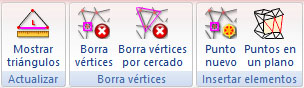

# Ficha de herramientas Edición TIN 3D

[Cinta de herramientas](../../untitled-12/)

En esta ficha de herramientas aparecen los comandos relacionados con los documentos TIN 3D.

Estos comandos aparecen agrupados según los siguientes epígrafes:

* [Actualizar](untitled-1.md)
* [Borra vértices](untitled-8.md)
* [Insertar elementos](untitled-273.md)

