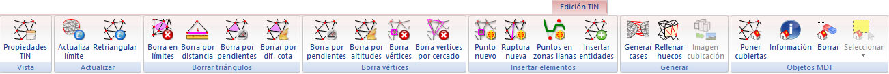

# Ficha de herramientas Edición TIN

[Cinta de herramientas](../../untitled-12/)

En esta barra de herramientas aparecen comandos asociados con la edición del modelo digital. Por ello, para que están disponibles se deberá tener activo un documento de modelo digital.

Estos comandos aparecen agrupados según los siguientes epígrafes:

* [Vista](untitled-228.md)
* [Actualizar](untitled-222.md)
* [Borrar triángulos](untitled-224.md)
* [Borra vértices](untitled-223.md)
* [Insertar elementos](untitled-226.md)
* [Generar](untitled-225.md)
* [Objetos MDT](untitled-227.md)

