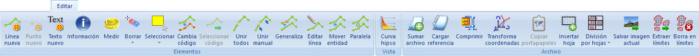

# Ficha de herramientas Editar

[Cinta de herramientas](../../untitled-12/)

En esta ficha de herramientas aparecen los comandos generales del programa, así como comandos para modificar la vista actual.

Los comandos aparecen agrupados según los siguientes epígrafes:

* [Elementos](untitled-230.md): Comandos relativos a la edición de elementos del documento activo.
* [Vista](untitled-236.md): Comandos relativos a la vista de propiedades del documento actual.
* [Archivo](untitled-229.md): Comandos relativos a la edición del documento activo.

