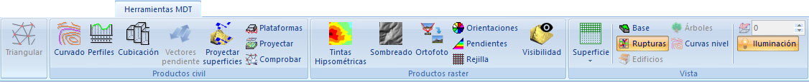

# Ficha de Herramientas MDT

[Cinta de herramientas](../../untitled-12/)

En esta ficha de herramientas aparecen los comandos relacionados con los modelos digitales del terreno.

Estos comandos aparecen agrupados según los siguientes epígrafes:

* [Triangular](../../como.../untitled-326.md): Herramienta para generar un modelo digital del terreno de tipo TIN.
* [Productos civil](untitled-261.md): Comandos relativos a la generación de documentos relacionados con Ingeniería Civil.
* [Productos ráster](untitled-262.md): Comandos relativos a la generación de documentos de imagen ráster.
* [Vista](untitled-264.md): Comandos relativos a la gestión de la vista del MDT.

Excepto la primera herramienta que estará activa con un documento de dibujo, el resto de herramientas estarán disponibles cuando se tenga activo un documento de modelo digital.

