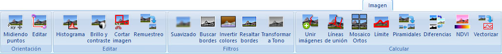

# Ficha de herramientas Imagen

[Cinta de herramientas](../../untitled-12/)

En esta ficha de herramientas aparecen los comandos relacionados con los documentos ráster de imagen: BMP, TIFF, JPEG o ECW.

Estos comandos aparecen agrupados según los siguientes epígrafes:

* [Orientación](untitled-292.md): Herramientas para cambiar la georreferenciación de la imagen.
* [Editar](untitled-231.md): Herramientas para cambiar el contenido de la imagen manualmente.
* [Filtros](untitled-258.md): Filtros a aplicar automáticamente al contenido de la imagen.
* [Calcular](untitled-11.md): Diversas herramientas de cálculo de imagen.

