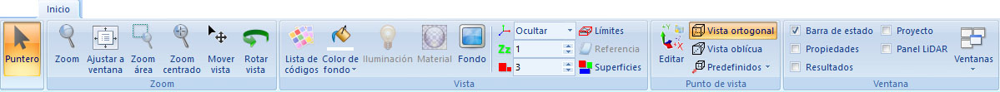

# Ficha de herramientas Inicio

[Cinta de herramientas](../../untitled-12/)

En esta ficha de herramientas aparecen los comandos generales del programa, así como comandos para modificar la vista actual.

Los comandos aparecen agrupados según los siguientes epígrafes:

* Puntero: Se elegirá esta opción cuando no se desee tener ninguna herramienta activa.
* [Zoom](untitled-272.md): Comandos relativos al movimiento del zoom sobre la pantalla.
* [Vista](untitled-271.md): Comandos relativos al aspecto de la vista.
* [Punto de vista](untitled-269.md): Comandos relativos al punto de vista.
* [Ventana](untitled-270.md): Comandos relativos a la organización de las ventanas.

