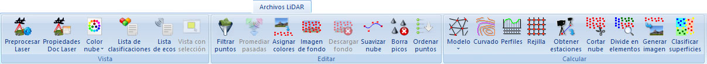

# Ficha de herramientas Archivos LiDAR

[Cinta de herramientas](../../untitled-12/)

En esta ficha de herramientas aparecen los comandos relacionados con los documentos de puntos medidos con dispositivos láser del [módulo láser](../../untitled-285/).

Estos comandos aparecen agrupados según los siguientes epígrafes:

* [Vista](vista-de-puntos-laser.md)
* [Editar](untitled-234.md)
* [Calcular](untitled-259.md)

Vea también:

* [Ficha de herramientas Puntos LiDAR](../untitled-253/)
* [Ficha de herramientas Clasificar LiDAR](../untitled-245.md)

