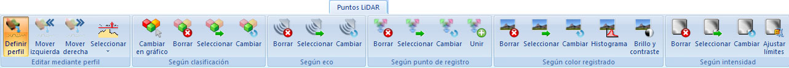

# Ficha de herramientas Puntos LiDAR

[Cinta de herramientas](../../untitled-12/)

En esta ficha de herramientas aparecen los comandos relacionados con los documentos de puntos medidos con dispositivos láser aerotransportados del [módulo láser](../../untitled-285/).

 Estos comandos aparecen agrupados según los siguientes epígrafes:

*  [Editar mediante perfil](untitled-232.md)
* [ Según clasificación](../../untitled-285/untitled-316/)
* [ Según eco](../../untitled-285/untitled-318/)
* [ Según punto de registro](../../untitled-285/untitled-320/)
* [ Según color registrado](../../untitled-285/untitled-317/)
* [ Según intensidad](../../untitled-285/untitled-319/)

 Vea también:

* [ Ficha de herramientas Archivos LiDAR](../untitled-252/)
* [ Ficha de herramientas Clasificar LiDAR](../untitled-245.md)

