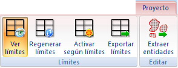

# Ficha de herramientas Proyecto

[Cinta de herramientas](../../untitled-12/)

En esta ficha de herramientas aparecen los comandos relacionados con los documentos de [proyecto](../../operaciones-con-archivos/untitled-312.md).

Estos comandos aparecen agrupados según los siguientes epígrafes:

* [Límites](untitled-278.md)
* [Editar](untitled-233.md)

