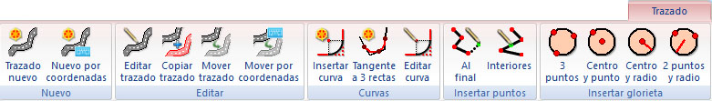

# Ficha de herramientas Trazado

[Cinta de herramientas](../untitled-12/)

En esta ficha de herramientas se agrupan las principales herramientas relacionadas con el registro de los trazados \(diseño horizontal\) de viales. Por tanto, para ser mostrada se debe tener activa la vista Trazado del actual documento de viales. Su aspecto es el siguiente:

 En esta ficha de herramientas aparecen los siguientes comandos:

* Trazado nuevo: Permite crear un trazado nuevo. Para ello, el usuario deberá indicar en pantalla con el botón izquierdo del ratón aquellos puntos que conforman el estado de alineaciones del nuevo trazado. Una vez que se haya terminado, se deberá pulsar el botón derecho del ratón, mostrando el programa un [cuadro de diálogo ](../untitled-288/trazado/untitled-138.md)donde se muestran los puntos registrados, junto a otras características del nuevo vial.
* Nuevo por coordenadas: Al igual que la opción anterior, permite crear un trazado nuevo, pero mostrando directamente el [cuadro de diálogo ](../untitled-288/trazado/untitled-138.md)para añadir puntos conociendo sus coordenadas.
* [Editar Trazado](../untitled-288/trazado/untitled-235.md): Permite editar un trazado seleccionando sus puntos en la ventana de dibujo.
* Copiar trazado: Permite copiar un trazado existente. Para ello seleccione con el botón izquierdo del ratón el trazado que desea copiar. Una vez seleccionado el trazado deseado acepte nuevamente con el botón izquierdo del ratón. Si no se seleccionó el trazado deseado, pulse el botón derecho del ratón para que el programa siga buscando en la misma localización hasta encontrar el deseado. Una vez aceptado, el programa mostrará el [cuadro de diálogo ](../untitled-288/trazado/untitled-138.md)de información del trazado.
* Mover trazado: Permite mover un trazado existente. Para ello seleccione con el botón izquierdo del ratón el trazado que desea copiar. Una vez seleccionado el trazado deseado mueva el ratón sin soltar el botón izquierdo hasta la nueva localización. Si no se seleccionó el trazado deseado, pulse el botón derecho del ratón para que el programa siga buscando en la misma localización hasta encontrar el deseado.
* Mover trazado por coordenadas: Permite mover un trazado existente indicando con el teclado el desplazamiento. Para ello seleccione con el botón izquierdo del ratón el trazado que desea copiar. Una vez seleccionado el trazado, el programa muestra un cuadro de diálogo donde se podrá especificar el desplazamiento en X e Y. Si no se seleccionó el trazado deseado, pulse el botón derecho del ratón para que el programa siga buscando en la misma localización hasta encontrar el deseado.
* Insertar Curva: Permite insertar un elemento curvo entre dos elementos rectos. Para ello se deberá seleccionar con el botón izquierdo del ratón una zona próxima al punto que actuará como vértice y, a continuación, aparecerá un [cuadro de diálogo ](../untitled-288/trazado/untitled-140.md)donde se podrán modificar las características de este nuevo elemento.
* Tangente a 3 rectas: Permite insertar un elemento curvo en una sucesión de tres elementos rectos, siendo tangente a todos ellos. Para ello se deberá seleccionar con el botón izquierdo del ratón, el elemento recto que queda en el interior.
* Editar Curva: Permite modificar un elemento curvo existente. Para ello el programa pide que se seleccione, con el botón izquierdo del ratón, el elemento curvo a editar mostrando, a continuación, el [cuadro de diálogo ](../untitled-288/trazado/untitled-140.md)con las características.
* Añadir vértice al final: Con este comando el programa permite incorporar vértices nuevos al trazado por alguno de sus extremos. Para ello el programa pedirá que se seleccione con el botón izquierdo del ratón el trazado que se desea modificar. Si al pulsar con el botón izquierdo no se selecciona el trazado deseado, se puede pulsar el botón derecho para seguir buscando trazados en la misma ubicación. Se deberá pulsar otra vez el botón izquierdo para aceptar la selección. Una vez hecho esto, el programa esperará a que el usuario empiece a registrar los vértices añadiéndolos por el extremo más próximo. Para terminar de registrar vértices se deberá pulsar el botón derecho del ratón, apareciendo un [cuadro de diálogo ](../untitled-288/trazado/untitled-140.md)con las características del trazado. Si durante la edición se pulsa el botón ESC, ésta se cancelará.
* Añadir vértice en el interior: Con este comando el programa permite incorporar vértices nuevos al trazado en el interior de éste. Para ello el programa pedirá que se seleccione con el botón izquierdo del ratón el trazado que se desea modificar. Si al pulsar con el botón izquierdo no se selecciona el trazado deseado, se puede pulsar el botón derecho para seguir buscando trazados en la misma ubicación. Se deberá pulsar otra vez el botón izquierdo para aceptar la selección. Una vez hecho esto, el programa esperará a que el usuario empiece a registrar los vértices. Estos vértices deberán estar en las proximidades del trazado.
* Nueva glorieta: Epígrafe para crear trazados circulares cerrados, como los utilizados en las glorietas. Una vez, creada la glorieta el programa mostrará un [cuadro de diálogo](../untitled-288/trazado/untitled-117.md). Las opciones disponibles son:
  * 3 puntos: Con esta opción se puede crear una glorieta indicando tres puntos por donde pasará el trazado.
  * Centro y punto: Con esta opción se puede crear una glorieta indicando el centro de ésta y un punto por donde pasará el trazado.
  * Centro y radio: Con esta opción se puede crear una glorieta indicando el centro de ésta y, posteriormente, el radio.
  * 2 puntos y radio: Con esta opción se puede crear una glorieta indicando dos puntos pasará el trazado y, posteriormente, el radio.

