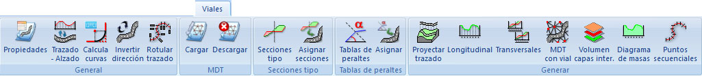

# Ficha de herramientas Viales

[Cinta de herramientas](../../untitled-12/)

En esta ficha de herramientas aparecen los comandos relacionados con el diseño de viales del [módulo Viales](../../untitled-288/).

Estos comandos aparecen agrupados según los siguientes epígrafes:

* [General](untitled-328.md)
* [MDT](untitled-330.md)
* [Secciones Tipo](untitled-315.md)
* [Tabla de Peraltes](untitled-323.md)
* [Generar](untitled-329.md)

