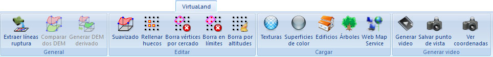

# Ficha de herramientas VirtuaLand

[Cinta de herramientas](../../untitled-12/)

En esta ficha de herramientas aparecen los comandos relacionados con los documentos de modelos digitales de tipo rejilla del [módulo VirtuaLand](../../untitled-289/).

Estos comandos aparecen agrupados según los siguientes epígrafes:

* [General](untitled-333.md)
* [Editar](untitled-332.md)
* [Cargar](untitled-331.md)
* [Generar Video](untitled-334.md)

