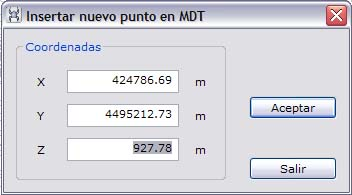

# Insertar nuevo punto en MDT

Esta herramienta permite insertar un nuevo punto en el modelo digital. El usuario debe indicar una posición planimétrica del nuevo punto y la aplicación mostrará un cuadro de diálogo con la cota interpolada sobre la triangulación:

El usuario puede modificar estos datos antes de ser insertado el punto en la triangulación.

