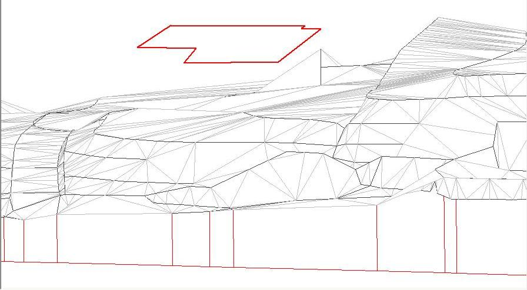
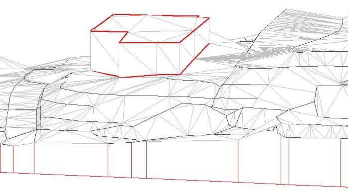
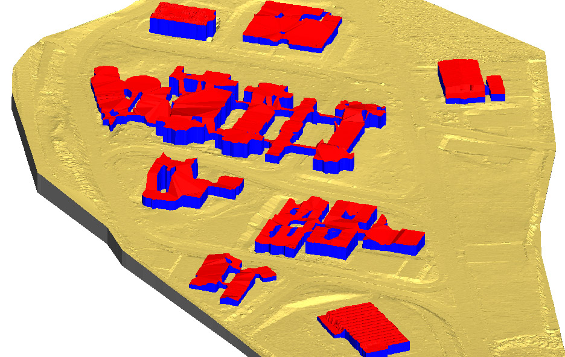

# Poner cubiertas

[Objetos MDT](../fichas-de-herramientas/untitled-247/untitled-227.md)

Herramienta para insertar cubiertas o entidades que no están posadas en el terreno al modelo digital. De esta forma, se generan objetos nuevos que serán incorporados al MDT actual, calculando nuevas triangulaciones con cada límite y los triángulos verticales que simulan dichos objetos con altura. El programa precisa que las cubiertas están almacenadas en un fichero de dibujo y con la cota de la cubierta.

En esta primera imagen se muestra el modelo digital con el fichero que contiene las cubiertas de referencia. Se puede observar que la cubierta está "flotando" sobre el modelo digital.

Se procede a llamar a la herramienta para que genere el sólido con la edificación, generando el siguiente modelo digital:

El programa ha calculado la proyección de la cubierta sobre el modelo digital, generando triángulos que simulan la parte superior del objeto y los triángulos verticales para generar el volumen de la edificación. Cabe decir, que en el fichero de entrada podrían existir entidades, interiores a cada superficie, que definan de mejor manera ésta. Por ejemplo, un conjunto de puntos que definan una azotea a dos aguas.

Para llevar a cabo esta operación, el programa presenta un cuadro de diálogo donde solicita los siguientes parámetros:

* **Fichero de entrada**: Se deberá indicar el fichero con entidades vectoriales cerradas que representan los límites superiores de los objetos a incluir. Estos ficheros también podrán llevar otras entidades no cerradas que permitan definir de mejor manera las superficies.
* **Tipo**: Se indicará qué tipo de objeto es, teniendo como opciones: Edificio, Puente y árbol.
* **Tejado**: Se indicará el código de los triángulos que se generarán en la parte superior del objeto. Pulsando el botón que aparece a la derecha, se abrirá el cuadro de diálogo con la [Lista de códigos ](../otras-herramientas/listacodigos/)que tiene almacenada el programa.
* **Pared**: Se indicará el código de los triángulos verticales que se generarán hasta su proyección con el MDT. Pulsando el botón que aparece a la derecha, se abrirá el cuadro de diálogo con la [Lista de códigos ](../otras-herramientas/listacodigos/)que tiene almacenada el programa.
* **Incluir entidades no cerradas**: Se podrán incluir aquellas entidades que no representan el límite exterior de la superficie, pero sí definen el interior de ésta. Por ejemplo, líneas de separación de aguas, medianerías o nubes de puntos que definen la superficie. Si se deselecciona, sólo se tendrán en cuenta aquellas entidades que están cerradas.
* **No incluir entidades bajo límite**: Se podrán excluir aquellas entidades no cerradas que están por debajo \(en cota\) de la superficie que las incluye.
* **No incluir entidades sobre límite**: Igualmente, se podrán excluir aquellas entidades no cerradas que están por encima \(en cota\) de la superficie que las incluye.

