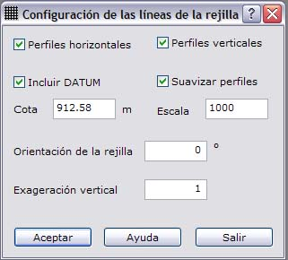

# Rejilla

[Rejilla](../../como.../untitled-276.md)

La aplicación permite generar una rejilla formada por puntos o lineales obtenida al proyectar dichas entidades sobre el modelo digital. Para ello aparecen los siguientes campos a rellenar:

* **Límites de la rejilla**: Se indicará las coordenadas máximas y mínimas en metros del rectángulo limite de la rejilla.
* **Frecuencia de la rejilla**: Incremento en metros en X e Y de los puntos.
* **Código de las entidades**: Código en el cual serán registradas las entidades que formen la rejilla.
* **Tipo de entidades**: Las entidades generadas en la rejilla podrán ser Puntos o Líneas. En el caso de elegir entidades puntuales, se registrará un punto cada incremento de coordenadas tanto en X como en Y. Si se eligen entidades lineales, se registrará líneas horizontales y/o verticales cada incremento de coordenadas tanto en X como en Y.
* **Almacenar puntos en líneas**: En el caso de elegir Puntos en el Tipo de entidades , éstos podrán ser almacenados como vértices de líneas. Su apariencia es similar a haber elegido entidades lineales para la formación de la rejilla, pero únicamente tendrán vértices en las intersecciones de filas y columnas; mientras que en el caso de entidades lineales, éstas tendrán vértices en todas las intersecciones con triángulos del modelo digital.
* **Configuración de las líneas**: En el caso de elegir Líneas en el Tipo de entidades, éstas podrán ser configuradas desde este [cuadro de diálogo](untitled-80.md)

