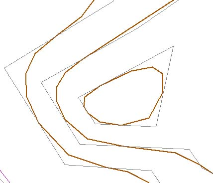
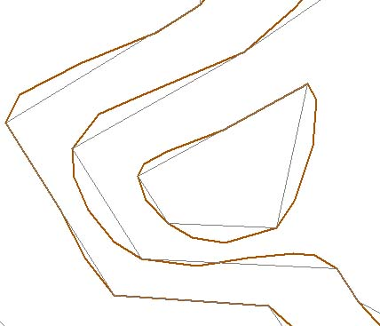
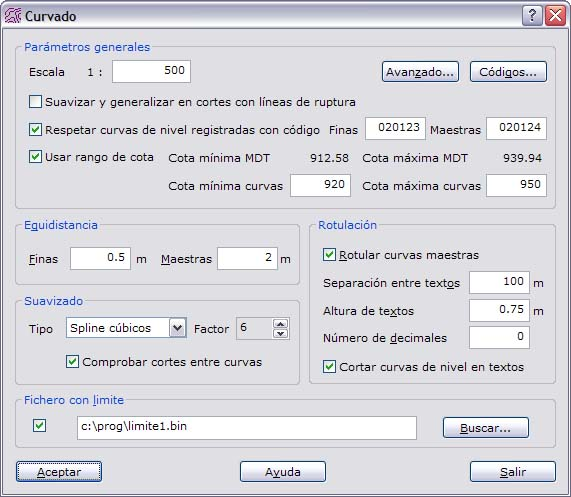

# Curvado

[Curvado](../../como.../untitled-219.md)

En este cuadro de diálogo aparecen los siguientes campos a rellenar:

* **Escala**: Indica el denominador de la escala final del documento. Es necesario para saber qué magnitudes de precisiones se han de tener en el momento de suavizado y generalizado de las curvas de nivel.
* **Suavizar y generalizar en cortes con líneas de ruptura**: Se activará esta opción si no es importante el corte de las curvas de nivel con las líneas de ruptura. Sin embargo, a determinadas escalas grandes, se hace necesario no generalizar y no suavizar el paso de las curvas de nivel por ciertas líneas de ruptura, como carreteras, caminos, etc., para lo cual convendrá desactivar esta opción.
* **Avanzado**: Muestra un [cuadro de diálogo ](untitled-92.md)con las opciones avanzadas de curvado, como la generalización de las curvas de nivel.
* **Códigos**: Mostrará un [cuadro de diálogo ](untitled-73.md)donde se podrán indicar los códigos de las diferentes identidades.
* **Respetar curvas de nivel registradas**: Se activará esta opción si el modelo digital del terreno contiene curvas de nivel entre sus líneas de ruptura y se desean utilizar éstas para generar el nuevo curvado. En el momento del cálculo, el trazado de estas curvas será prioritario respecto de otros trazados. Para ello se deberá designar el código de las curvas finas y/o el de las maestras. Si no se conoce alguno de los códigos se puede dejar en blanco. No es necesario que coincida la equidistancia de las curvas de nivel registradas con la del nuevo curvado.
* **Usar rango de cota**: Se activará esta opción cuando sólo se desee curvar en un rango específico de cotas. Para ayudar en esta elección, el programa muestra el rango de cotas en el que se encuentra el modelo digital del terreno.
* **Equidistancia**: Indica la distancia altimétrica en metros a la que se trazarán las distintas curvas de nivel. El valor de la equidistancia de las curvas maestras debe ser múltiplo del valor de la equidistancia de las curvas finas. Lo normal es que sea 4 o 5 veces mayor.
* **Suavizado**: Las curvas de nivel interpoladas en los diferentes triángulos y unidas pueden ser suavizadas o no. Para suavizar se pueden utilizar dos algoritmos diferentes y cuando se elija alguno de ellos, se podrá comprobar que no se producen cortes entre las curvas suavizadas. Para indicar al programa el tipo de suavizado se deberá atender a los siguientes campos:
  * Tipo: Se puede elegir entre No suavizar o suavizar utilizando el algoritmo de B-splines o Splines cúbicos. Si no se suavizan las curvas, se obtendrán las curvas interpoladas directamente en los triángulos con formas muy angulosas. El algoritmo de B-splines generará curvas tangentes a los diferentes tramos, pero sin pasar por sus vértices. El algoritmo de Splines cúbicos generará curvas suavizadas que pasan por todos los vértices de la curva original.
  * Factor: Cuando se elige suavizar las curvas de nivel, se activa un control a la derecha para poder variar el factor de suavizado. Este factor podrá variar entre 10 \(máximo suavizado\) y 1 \(mínimo suavizado\), y actúa como un factor de ponderación para ajustarse más o menos a la línea original sin suavizar. Si se elige el suavizado de tipo Splines cúbicos, el valor 10 corresponde con splines cúbicos naturales.
  * Factor de suavizado: Las curvas de nivel interpoladas en los diferentes triángulos y unidas pueden ser suavizadas o no. Si son suavizadas se utilizará el algoritmo de Splines cúbicos. Este tipo de suavizado puede ser utilizando splines cúbicos naturales, que es el de mayor suavizado y corresponde con el valor 10. Si se indica un valor entre 1 y 9, el algoritmo utilizado será mediante splines cúbicos ponderados, siendo el suavizado de menos a más.
  * Comprobar cortes entre curvas: Un curvado muy suavizado podrá desvirtuar el resultado, pudiéndose producir cortes entre aquellas curvas de nivel que están muy próximas. Por ello el programa utiliza un algoritmo para buscar y arreglar estos errores. Sin embargo, este procedimiento puede dilatar el cálculo innecesariamente en terrenos donde las curvas no están cercanas, por lo que se puede desactivar este paso.

* **Fichero con límite**: Fichero de dibujo con el límite del área a curvar. El formato de este fichero puede ser BIN de DIGI, DXF de AutoCad, DGN de MicroStation o un fichero ASCII con las coordenadas que forman el límite. El límite podrá estar compuesto por una o varias líneas cerradas. En el caso del fichero ASCII sólo podrá ser leída una línea.
* **Rotulación de curvas maestras**: Indica si se registrarán textos con la cota de las curvas maestras. Estos textos de rotulación se colocarán a lo largo de las curvas. Estos rótulos vienen definidos por los siguientes parámetros:
* **Separación entre textos**: Separación en metros entre textos en una misma curva de nivel, medida a lo largo de dicha curva.
* **Altura de textos**: Altura en metros de los textos de rotulación.
* **Número de decimales**: Cantidad de dígitos decimales que contendrá el texto con la cota de la curva.
* **Cortar curvas de nivel en textos**: Se deberá activar esta opción si se desea que haya un hueco en las curvas de nivel rotuladas en el espacio que ocupa el texto.

Ejemplo:

En este ejemplo, se realizará un curvado a escala 500, con isolíneas suavizadas con el algoritmo de splines cúbicos a nivel 6, es decir, medianamente suavizadas, y una equidistancia de 0.5 metros de las curvas finas y de 2 metros de las curvas maestras. Sin embargo, no se suavizarán las curvas de nivel a su paso por las líneas de ruptura, pero sí se tendrán en cuenta curvas de nivel ya registradas en el modelo con códigos 020123 y 020124. Se rotularán las curvas maestras, estando los textos separados 100 metros, su altura de 0.75 metros, ningún decimal en los textos de rotulación y se cortarán dichas curvas en el espacio que ocupan los textos. Asimismo, se utilizará un archivo de límite para sólo curvar dentro de él y sólo se curvará entre las cotas 920 y 950 metros.

