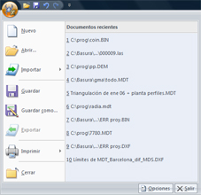

# Botón de MDTopX

La interfaz de usuario de MDTopX se ha rediseñado significativamente. El botón de MDTopX  remplaza el menú Archivo y está situado en la esquina superior izquierda de la interfaz.

Al hacer clic en el botón de MDTopX , verá los mismos comandos básicos disponibles en versiones anteriores de MDTop para abrir, guardar e imprimir el archivo.

* [Nuevo ](../operaciones-con-archivos/untitled-4.md): Genera un nuevo archivo.
* [Abrir](../operaciones-con-archivos/untitled.md): Abre un documento existente.
* [Importar](../operaciones-con-archivos/importar/untitled-265.md): Para importar datos procedentes de otros tipos de modelos digitales.
* Guardar: Guarda el documento actual. Sólo estará activa esta opción si el documento fue modificado. Si el documento ya existía, éste se salvará en el mismo formato. Si el documento no existía se mostrará el explorador de Windows para elegir su ubicación y su formato. Si se desea salvar en otro formato diferente se deberá utilizar el comando Guardar como , explicado a continuación. Los formatos disponibles dependen del tipo de documento y son los siguientes:
  * Si es un archivo de modelo digital sólo se podrá salvar en formato MDT.
  * Si es un archivo de dibujo se podrá salvar en formato BIN, DXF, DXF para versiones AutoCad 2000 o superior, o DGN.
  * Si es un archivo de imagen se podrá salvar en formato TIFF, BMP o JPEG.
* Guardar como: Guarda el documento actual con un nombre o carpeta destino diferente a la actual. El programa abre el explorador de Windows para indicar el nombre y la carpeta de destino.
* Exportar: Para exportar los datos del documento actual. Sólo estará disponible si se tiene activo un documento de modelo digital o un documento con viales.
  * Si el documento es un modelo digital, sus datos se podrán almacenar en otro tipo de estructura de modelo digital. Además, se tiene la posibilidad de ser ejecutada desde la [línea de comandos ](../untitled-277/untitled-243.md). Los posibles formatos a exportar son los siguientes:
    * [Archivos DIGI](../operaciones-con-archivos/exportar/untitled-101.md): Archivos con cartografía para el programa DIGI.
    * [Archivos DXF](../operaciones-con-archivos/exportar/untitled-101.md): Archivos con cartografía para AutoCad.
    * [Archivos DXF 2000](../operaciones-con-archivos/exportar/untitled-101.md): Archivos con cartografía para AutoCad 2000 o superior.
    * [Archivos DGN](../operaciones-con-archivos/exportar/untitled-101.md): Archivos con cartografía para MicroStation 7 o inferior.
    * [Archivos DEM para la aplicación VirtuaLand ](../operaciones-con-archivos/exportar/untitled-102.md): Modelo digital del terreno de tipo rejilla para VirtuaLand.
    * [Archivos ASCII ](../operaciones-con-archivos/exportar/untitled-100.md): Modelo digital del terreno de tipo rejilla guardado en formato ASCII, como listado de puntos.
    * [Archivos de formato GTOPO30 del USGS](../operaciones-con-archivos/exportar/untitled-103.md) : Modelo digital del terreno de tipo rejilla guardado en el formato perteneciente al USGS \(United States Geological Survey\).
    * [Archivos SGE ](../operaciones-con-archivos/exportar/untitled-104.md): Modelo digital del terreno de tipo rejilla perteneciente al Servicio Geográfico del Ejército.
    * [Archivos grid de ArcInfo ](../operaciones-con-archivos/exportar/untitled-100.md): Modelo digital del terreno de tipo rejilla para el programa ArcInfo.
    * [Archivos para ArcView ](../operaciones-con-archivos/exportar/untitled-104.md): Modelo digital del terreno de tipo rejilla para el programa ArcView.
    * Archivos MTN 25: Modelo digital del terreno de tipo rejilla para el formato del Instituto Geográfico Nacional.
    * [Archivos LH Socet Set ](../operaciones-con-archivos/exportar/untitled-104.md): Modelo digital del terreno de tipo rejilla para el programa fotogramétrico Socet Set.
    * Archivos binarios Stereolithography: Fichero STLB de modelado con objetos tridimensionales.
    * Archivos ASCII Stereolithography: Fichero STLA de modelado con objetos tridimensionales.
  * Si el documento es un documento con viales, y cuando se llamó al comando estaba activa la vista de trazados, el programa mostrará un [cuadro de diálogo ](../operaciones-con-archivos/exportar/untitled-105.md)para elegir los trazados y alzados a exportar. Se podrá exportar a los siguientes tipos de formatos:
    * Archivos DIGI: Archivos con cartografía para el programa DIGI.
    * Archivos DXF: Archivos con cartografía para AutoCad.
    * Archivos DXF 2000: Archivos con cartografía para AutoCad 2000 o superior.
    * Archivos DGN: Archivos con cartografía para MicroStation.
* Imprimir: Imprime el documento actual.
* Presentación preliminar: Muestra en pantalla cómo se imprimiría el documento actual.
* Configurar impresora: Configura el dispositivo de salida de impresión.
* Lista de archivos recientes: Muestra el listado de máximo 10 archivos con los últimos documentos utilizados. Es una manera rápida de abrir documentos ya generados.
* Cerrar: Cierra el documento actual. Si el documento ha sido modificado y no ha sido salvado antes, el programa preguntará por ello.

Además de las opciones del menú, se muestran dos botones con la siguiente funcionalidad:

