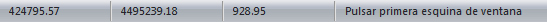

# Barra de estado

[Interfaz de usuario](interfaz-de-usuario.md)

La barra de estado aparece en la parte inferior de la pantalla y está dividida en varias partes con información diferente.

Esta información, ordenada de izquierda a derecha es la siguiente:

* Coordenada X terreno de donde está el ratón actualmente. Si se tiene activo un documento con imagen sin georreferenciación mostrará el píxel medido en el eje de abscisas a partir de la esquina inferior izquierda de la imagen.
* Coordenada Y terreno de donde está el ratón actualmente. Si se tiene activo un documento con imagen sin georreferenciación mostrará el píxel medido en el eje de ordenadas a partir de la esquina inferior izquierda de la imagen.
* Coordenada Z terreno de donde está el ratón actualmente, si se tiene activo un documento con un modelo digital del terreno o un modelo digital del terreno como [referencia](../operaciones-con-archivos/untitled-14.md). Esta coordenada será interpolada dentro del triángulo donde se encuentre el puntero. Si no se halla ningún triángulo se mostrará un 0.0. Si se tiene activo un documento con imagen mostrará el valor RGB del píxel donde está el ratón.
* Información adicional de la herramienta. Mensajes de la herramienta para saber qué hacer y qué espera la aplicación que se realice.

Si el tamaño de la ventana no es suficientemente grande, es posible que no se muestran algunos campos, desapareciendo primero los que están a la derecha.

Si se pulsa con el botón de la derecha del ratón sobre esta barra se podrán elegir los campos que se desean visualizar.

Para mostrar esta barra debe activar la opción Barra de estado de la [Ficha de herramientas Inicio](../fichas-de-herramientas/untitled-251/).

