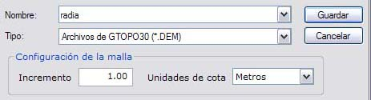

# Exportar GTOPO30

El programa permite exportar el modelo digital generado al formato GTOPO30 del USGS. Para ello presenta el explorador de Windows para indicar nombre de archivo y carpeta y dos campos especificando características del modelo digital: La separación de la malla y la unidad de la cota de los puntos:

El programa generará dos archivos: uno con la malla de los puntos y otro con la cabecera, donde se incluye información acerca del modelo digital generado.

