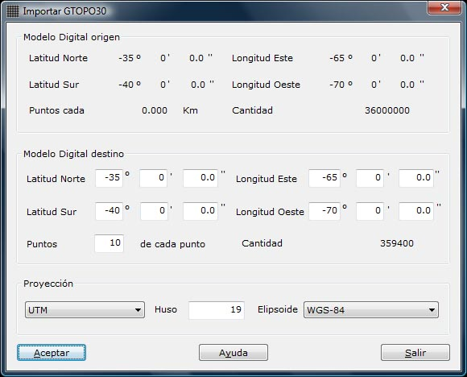

# Importar GTOPO30

[Importar archivo](untitled-265.md)

La aplicación permite importar archivos GTOPO30 pertenecientes al USGS que son mallas de puntos separados 30 segundos sexagesimales de arco de diferentes zonas del mundo. Por tanto, el modelo digital es del tipo DEM que hay que transformar al formato de MDTop.

El programa muestra un cuadro de diálogo con la zona que se desea importar y el nivel de precisión de la importación.

En este cuadro de diálogo aparecen los siguientes campos:

* Datos del modelo digital origen:
* Límites del modelo digital en coordenadas geográficas.
* Separación de los puntos de la malla en kilómetros.
* Cantidad de puntos estimados. Si la zona incluye zona oceánica, tendrá menos puntos.
* Datos del modelo digital destino:
* Límites del modelo digital en coordenadas geográficas: Se indicará el límite del modelo destino, siempre dentro de los límites del modelo digital origen.
* Razón de traspaso: Se indicará la razón de importación, es decir, cada cuántos puntos se seleccionará un punto. Por ejemplo, si se indica 5, se traducirá sólo un punto cada 5 puntos leídos.
* Cantidad de puntos estimados: En función de los límites destino indicados y la razón de traspaso, se estima una cantidad de puntos destino.
* Proyección: En este apartado se indicará el tipo de proyección al que se transformarán las coordenadas geográficas leídas. Los tipos disponibles son Geográficas, Mercator directa o UTM . Si se selecciona este último tipo habrá que indicar el huso .

