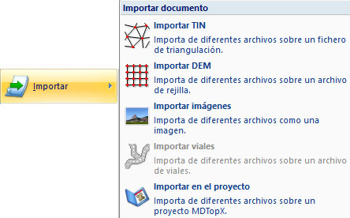

# Importar archivo

[Botón de MDTopX](../../introduccion/untitled-10.md)

Para importar un archivo existente, el usuario debe pulsar sobre el [botón de MDTopX](../../introduccion/untitled-10.md)  y elegir el comando Importar. A continuación, el programa mostrará un menú donde se podrá elegir el tipo de documento a importar.

Las opciones de este menú son las siguientes:

* Importar TIN: Esta opción creará un documento con un Modelo Digital del terreno de tipo TIN. Los tipos de archivo contemplados son:
  * [Archivos con formato GTOPO30 del USGS](untitled-124.md) . Modelo digital del terreno de formato rejilla, perteneciente al USGS \(United States Geological Survey\).
  * Archivos con formato de modelo digital del MTN 25: Modelo digital del terreno de formato rejilla almacenado como un archivo ASCII con cabecera donde se reflejan las propiedades de la rejilla, y un conjunto de cotas que representan los puntos de la rejilla.
  * Archivos DEM de VirtuaLand: Modelo digital del terreno de formato rejilla procedente del módulo VirtuaLand.
  * Archivos del SIG del Olivo: Modelo digital del terreno de formato rejilla procedente de la cartografía del SIG del Olivo de TRAGSA. Se mostrará un [cuadro de diálogo ](untitled-127.md)para indicar las opciones de importación.
  * Archivos de MGE Terrain Analyst: Modelo digital del terreno de formato rejilla procedente del programa MGE. Se mostrará un [cuadro de diálogo ](untitled-127.md)para indicar las opciones de importación.
  * Archivos SRTM: Modelo digital del terreno de formato rejilla, perteneciente al USGS \( United States Geological Survey \).
  * Archivos ArcView: Modelo digital del terreno de tipo rejilla del programa ArcView.
  * Archivos INGR: Modelo digital del terreno de formato rejilla de Intergraph. Suelen tener extensión GRD. Se mostrará un [cuadro de diálogo ](untitled-127.md)para indicar las opciones de importación.
* Importar DEM: Esta opción creará un documento con un Modelo Digital del terreno de tipo DEM. Los tipos de archivo contemplados son:
  * [Archivos con formato GTOPO30 del USGS ](untitled-124.md). Modelo digital del terreno de formato rejilla, perteneciente al USGS \(United States Geological Survey\).
  * Archivos BIN de DIGI
  * Archivos ASCII
  * Archivos TIFF
* [Importar imágenes](untitled-125.md)
* Importar viales: Esta opción importa sobre un documento con geometría de viales activo, es decir, debe haberse creado previamente. Se podrán [incorporar datos almacenados en otros formatos ](untitled-267/)como trazados o como alzados.
* Importar en el proyecto

