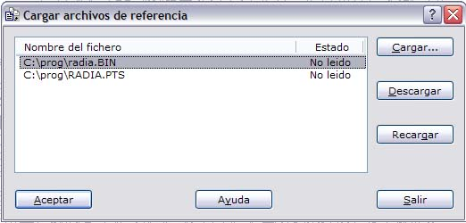

# Abrir archivos de referencia

[Editar Archivo](../fichas-de-herramientas/untitled-248/untitled-229.md)

El programa permite cargar archivos de referencia para analizar la combinación de varios archivos con cartografía para, por ejemplo, comprobar cómo ha curvado el programa un modelo digital o cómo casan dos curvados contiguos.

Sólo se permiten cargar como archivos de referencia, archivos de dibujo \(archivos con formato DIGI, AutoCad, MicroStation, ASCII, o TopCal\) o archivos como modelos digitales \(MDT\). No se pueden cargar archivos de referencia de imagen, pero sí se puede cargar sobre un documento imagen otros archivos de referencia. Por ejemplo, se puede generar un mapa de tintas hipsométricas y cargar como fichero de referencia el modelo digital que lo generó para comprobar las cotas con los colores obtenidos.

Cuando se llama a esta herramienta el programa muestra el siguiente cuadro de diálogo:

Desde él, se podrán cargar archivos de referencia nuevo o descargar los actuales. Para ello muestra una lista con los archivos de referencia actuales. Para cargar archivos nuevos se deberá pulsar el botón Cargar y para descargar archivos actuales, éstos se deberán seleccionar primero en la lista utilizando el botón izquierdo del ratón y pudiéndose ayudar de las teclas Ctrl y Mayúsculas para hacer multi-selección, y pulsar posteriormente el botón Descargar.

Es posible también volver a recargar un archivo, cuando éste ha sido modificado después de haber sido cargado, pulsando el botón Recargar. Esta opción es útil cuando se tiene de referencia un archivo con el curvado sobre el documento con el modelo digital, y éste se vuelve a curvar, guardando el curvado con el mismo nombre del archivo de referencia. Sin descargar el archivo de referencia se puede volver a recargar.

