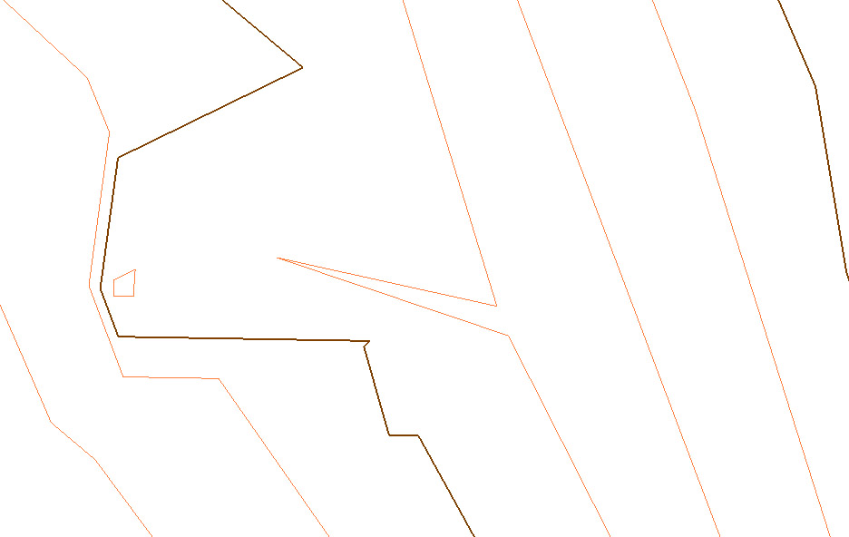
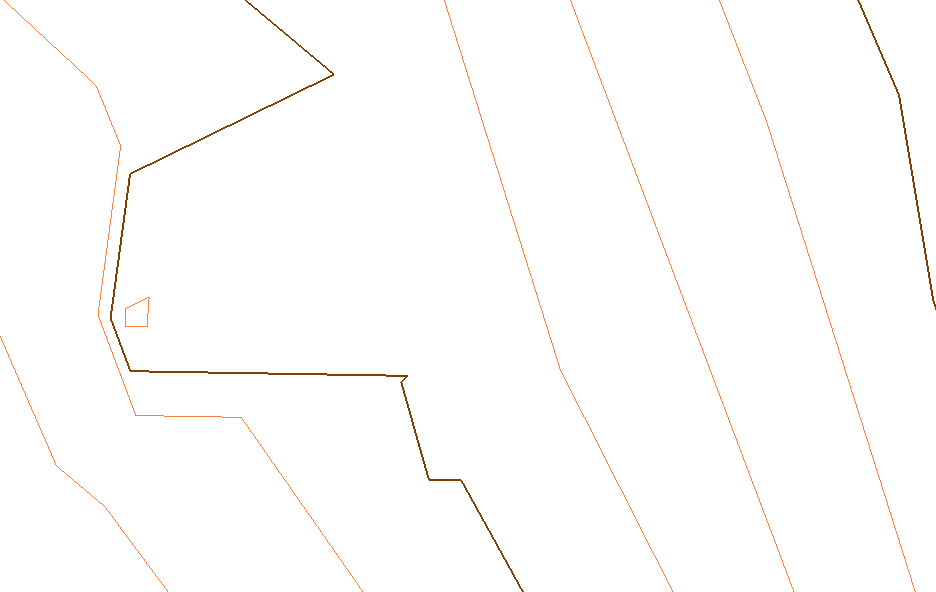
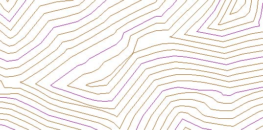
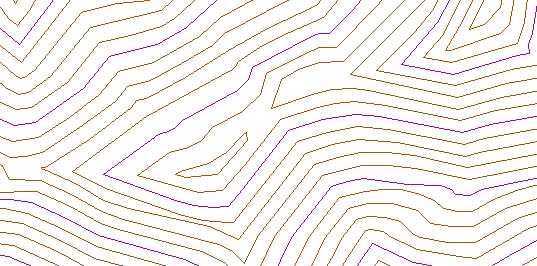
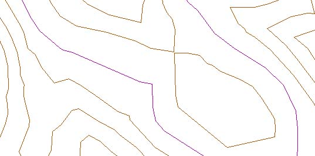
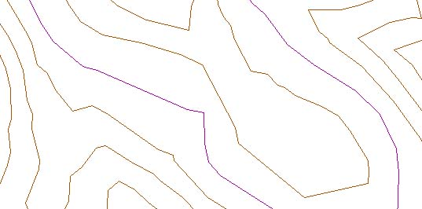

# Generalizar entidades

[Editar Elementos](../../fichas-de-herramientas/untitled-248/untitled-230.md)

El programa permite generalizar las entidades gráficas de un documento de dibujo, es decir, eliminar aquellos puntos que no añaden información relevante para definir la geometría de una entidad a una determinada escala.

Para ello, el programa muestra un cuadro de diálogo, donde se solicitan los siguientes datos:

* **Denominador de la escala**: Se deberá indicar el denominador de la escala para que el programa determine los umbrales de generalización. Es importante definir correctamente este valor, porque un punto puede ser importante a escala 1:500 pero irrelevante a escala 1:1000. Cuanto más grande sea este valor, más puntos serán generalizados, siendo las entidades resultantes más toscas. Si se desean cambiar los valores umbral de generalización se puede hacer desde el [cuadro de diálogo ](../../herramientas-mdt/untitled-93/untitled-92.md)que se muestra pulsando el botón Avanzado
* **Generalización lineal**: Se activará esta opción si se desea generalizar linealmente las entidades, es decir, proceder al filtrado de puntos que no aportan información a la definición geométrica de la entidad.
* **Generalización superficial**: Se activará esta opción si se desean filtrar aquellas entidades cerradas que no superan una determinada superficie límite.
* **Borrar picos**: Se podrá activar esta opción para eliminar picos en las entidades lineales, que son tramos que se generan en una línea como consecuencia del desvío de uno de sus puntos. Su aspecto es el de un triángulo con un ángulo muy agudo.

* **3 dimensiones**: Si se activa esta opción también se tendrá en cuenta la altimetría de los puntos, de tal forma que no se generalizará un punto que en planimetría no es significativa si su cota sí lo es.
* **Entidades procedentes de datos LiDAR**: Se activará esta opción si el fichero procede de un cálculo a partir de datos LiDAR, como la extracción de límites. En este caso, se podrán hacer otras consideraciones diferentes. Para ello, se necesitan los siguientes parámetros:
  * Tolerancia lineal: Tolerancia de registro LiDAR.
  * Tolerancia angular: Tolerancia angular entre tramos para no considerar picos.
* **Tipología**: Se podrá indicar la procedencia de las entidades a generalizar. En función de esta naturaleza, se tomarán diferentes decisiones.
  * General: Entidades de tipo general, sin especificar.
  * Edificaciones: Entidades que representan los límites de edificaciones. Al ser construcciones artificiales suelen tener relaciones de alineación, perpendicularidad o paralelismo que se buscarán entre los diferentes tramos de la línea.
  * Tratar las entidades como curvas de nivel: Si se activa esta opción el programa tratará las entidades como curvas de nivel, procediendo a nuevas algoritmos para la unión de superficies cercanas o la generación de superficies nuevas cuando existe un estrangulamiento de la entidad original. Este tratamiento puede ser dado a cualquier conjunto de entidades que representen a superficies.

* **Algoritmo**: Se dan diferentes opciones de algoritmos de generalización:
  * Douglas-Peucker: Es el algoritmo más utilizado por las aplicaciones que generalizan entidades vectoriales. Además, el programa da la opción de poder comprobar el ángulo para no eliminar algunos puntos significativos.
  * Un punto de cada n: Es aleatorio. Se eliminará un punto por cada número de puntos que el usuario indique.
  * Lang
  * Wang-Muller
  * Reumann-Witkam

