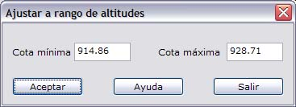

# Seleccionar gama de color

[Vista de superficie de MDT](../herramientas-de-visualizacion/untitled-263.md)

Si el usuario seleccionar ver la superficie mediante Triángulos con colores o Vértices con colores, la aplicación mostrará un cuadro de diálogo donde se podrá seleccionar la gama de color a utilizar. Este cuadro de diálogo se muestra cuando se quiere visualizar la nube de puntos LiDAR según altitud.

Esta gama de color es función de la altitud de los elementos. En el cuadro de diálogo aparecen los siguientes campos a rellenar:

* **Cota máxima y mínima**: Cota máxima y mínima del modelo digital, para ofrecer información al usuario para elaborar la tabla de intervalos de altura.
* **Nombre de la gama**: Nombre de la gama de colores a utilizar. Las tablas podrán ser añadidas, eliminadas o duplicadas con otro nombre, para ser utilizadas en diferentes archivos.
* **Tabla de intervalos de altura**: Se podrán establecer en esta tabla la relación entre colores y diferentes alturas. Los intervalos podrán ser Añadidos, Eliminados o Editados, para adaptarse al rango de cotas del documento. Aquellas superficies que sean superiores a la cota superior o menores a la cota inferior de esta tabla, no serán coloreadas.
* **Ajustar a rango de altitudes**: Existe la opción de poder ajustar una tabla de intervalos a unos límites de cota especificados por el usuario, mediante este [cuadro de diálogo](../herramientas-mdt/untitled-157/untitled-17.md)

* \*\*\*\*[**Curva hipso**](untitled-90.md): Se podrá mostrar la distribución de superficies del fichero en función de la cota con el objetivo de poder diseñar mejor la gama de color.

Para conocer más acerca de gamas de color, consulte el apartado de [Tintas hipsométricas](../como.../untitled-282.md).

