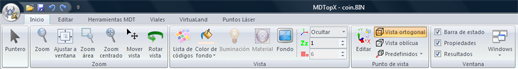

# Minimizar la cinta de herramientas

[Cinta de herramientas](./)

La cinta de herramientas se ha diseñado para ayudar al usuario a encontrar fácilmente los comandos necesarios para completar una tarea. Los comandos se organizan en grupos lógicos, que se reúnen en fichas. Cada ficha está relacionada con un tipo de actividad \(como Herramientas MDT o Editar\). Para reducir la aglomeración en pantalla, algunas fichas sólo se muestran cuando son necesarias.

No hay forma de eliminar o reemplazar la cinta de herramientas por las barras de herramientas y los menús de versiones anteriores de MDTop. No obstante, puede minimizar la cinta de herramientas para que el área de trabajo sea mayor.

Para mantener siempre la cinta de herramientas minimizada:

* Haga clic en [Personalizar barra de herramientas de acceso rápido](untitled-306.md).
* En la lista, haga clic en Minimizar la cinta de herramientas.
* Para usar la cinta de herramientas minimizada haga clic en la ficha que desee utilizar y, a continuación, en la opción o en el comando deseado. Por ejemplo, con la cinta de herramientas minimizada, puede hacer clic en la ficha Inicio y seleccionar un comando. Después, la cinta de herramientas se vuelve a minimizar.

Para restaurar la cinta de herramientas:

* Haga clic en [Personalizar barra de herramientas de acceso rápido](untitled-306.md).
* En la lista, haga clic en Minimizar la cinta de herramientas.

Para minimizar rápidamente la cinta de herramientas, haga doble clic en el nombre de la ficha activa. Vuelva a hacer doble clic en una ficha para restaurar la cinta de herramientas. El método abreviado de teclado para minimizar o restaurar la cinta de herramientas es presionando CTRL+F1.

Puede seguir usando los métodos abreviados de teclado mientas la cinta de herramientas está minimizada. Para obtener más información sobre métodos abreviados de teclado, vea [Utilizar la cinta de herramientas mediante teclado](untitled-327.md).

