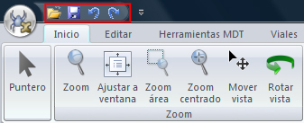
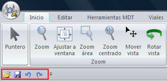

# Mover la barra de herramientas de acceso rápido

[Cinta de herramientas](./)

La barra de herramientas de acceso rápido es una barra de herramientas personalizable que contiene un conjunto de comandos independientes de la ficha que se está mostrando.

La barra de herramientas de acceso rápido puede ubicarse en uno de estos dos lugares:

* Esquina superior izquierda junto al [botón de MDTopX  ](../introduccion/untitled-10.md)\(ubicación predeterminada\)

* Debajo de la cinta de herramientas

Si no desea que la barra de herramientas de acceso rápido se muestre en su ubicación actual, puede moverla a la otra ubicación. Si observa que la ubicación predeterminada situada junto al [botón de MDTopX ](../introduccion/untitled-10.md)está demasiado lejos del área de trabajo para que su uso sea cómodo, quizá desee acercarla al área de trabajo. La ubicación situada debajo de la cinta de herramientas invade el área de trabajo. Por lo tanto, si desea maximizar el área de trabajo, puede que desee mantener la barra de herramientas de acceso rápido en su ubicación predeterminada.

Para cambiar la ubicación actual de la barra de herramientas:

* Haga clic en [Personalizar barra de herramientas de acceso rápido](untitled-306.md).
* En la lista, haga clic en Mostrar debajo de la cinta de herramientas.

