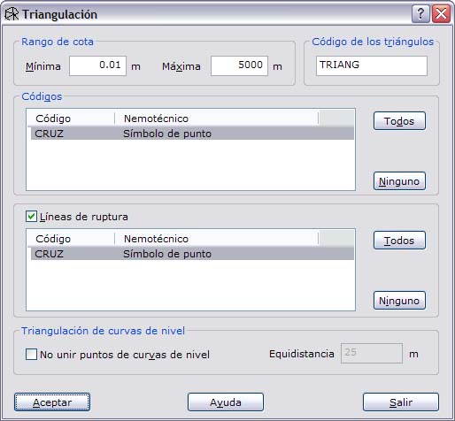
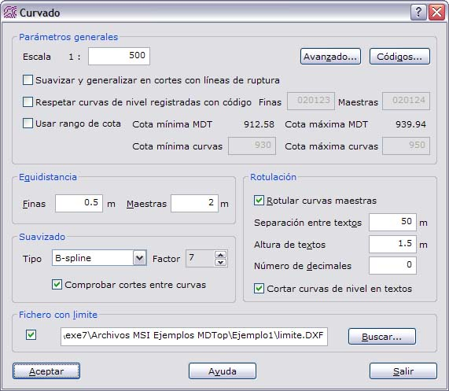
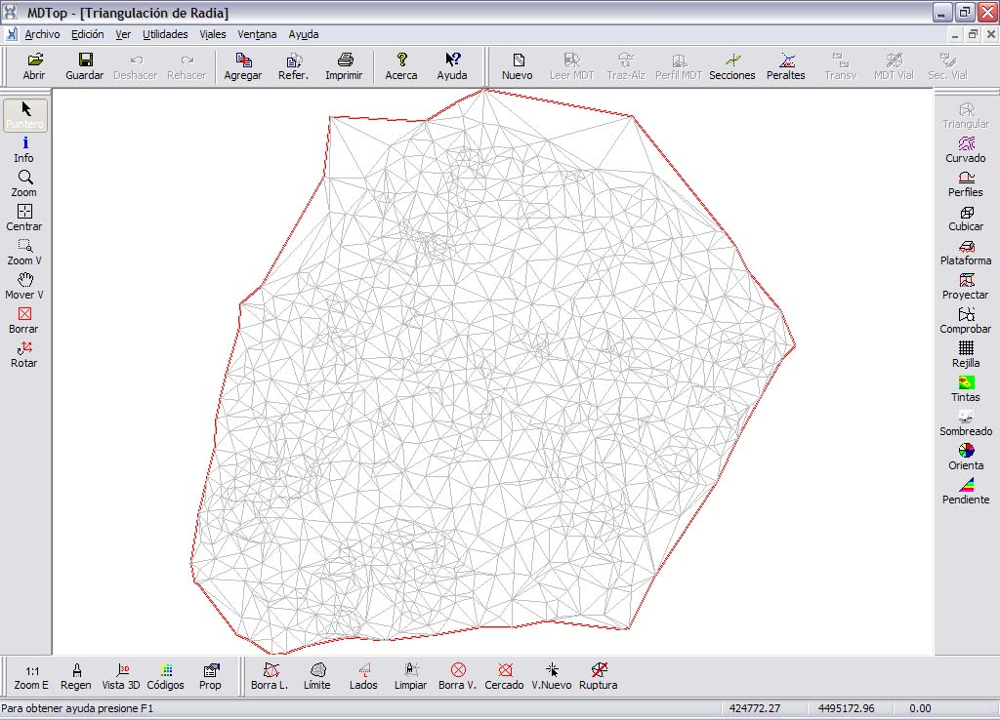
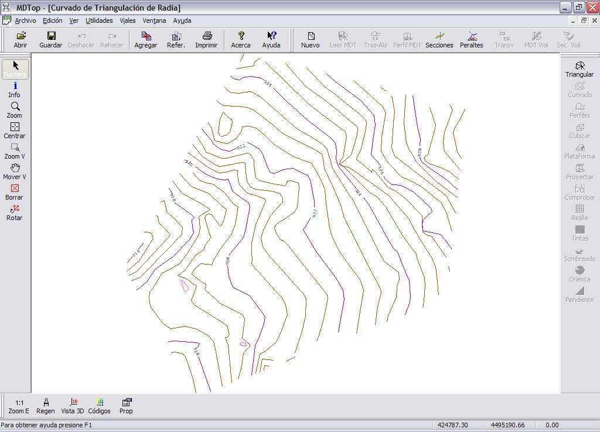

# Ejemplo 1: Curvado a partir de una nube de puntos

[Ejemplos](./)

### Objetivo

Obtener el curvado de una zona a partir de un taquimétrico.

### Ficheros iniciales

* RADIA.PTS: Fichero con formato TopCal, y con los puntos tomados en un taquimétrico de cuya zona se quiere obtener un curvado.
* LIMITE.DXF: Fichero con formato DXF de AutoCad, con el límite de la zona que se quiere curvar. Está compuesto simplemente por una línea cerrada.

### Proceso

* Cargar el fichero RADIA.PTS en pantalla. Para ello utilice la orden [Abrir ](../operaciones-con-archivos/untitled.md)del menú del [Botón MDTopX](../introduccion/untitled-10.md), seleccionando el tipo de archivos TopCal.
* En pantalla se podrá ver una nube de puntos con dos textos indicando el número y la cota.
* Llamar a la orden [Triangulación ](../como.../untitled-326.md)de la ficha de herramientas [Herramientas MDT](../fichas-de-herramientas/untitled-249/), que generará un modelo digital del terreno con los datos tomados en el taquimétrico. El fichero sólo está compuesto por puntos, por lo que no tendrá líneas de ruptura. Se genera un modelo digital compuesto por multitud de triángulos visibles en pantalla.

* Con este archivo activo, llamar a la orden [Curvado ](../como.../untitled-219.md)de la ficha de herramientas [Herramientas MDT](../fichas-de-herramientas/untitled-249/). Aparecerá un cuadro de diálogo que se deberá rellenar con la información que se desea obtener en el curvado \(equidistancias, suavizado, textos...\). En el campo fichero con límite se deberá introducir el nombre del fichero DXF que contenía el límite de la zona a curvar. Se genera un curvado que se podrá salvar posteriormente en el formato deseado.

### Ficheros resultantes

* TRIANGULACION DE RADIA: Fichero con el modelo digital del terreno y formato propio de MDTop.

* CURVADO DE TRIANGULACION DE RADIA: Fichero con formato dibujo con las curvas de nivel. Este archivo podrá ser salvado para su edición en formato BIN de DIGI, DXF de AutoCad o DGN de MicroStation.

