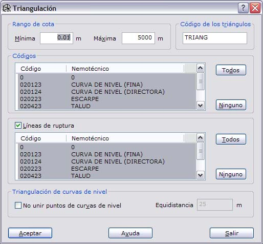
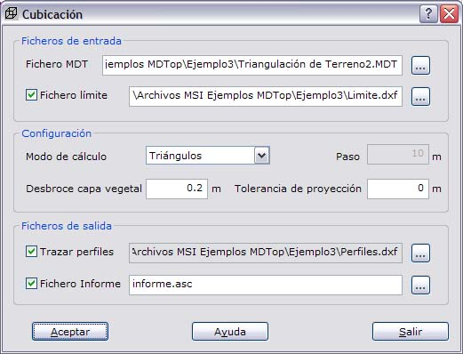
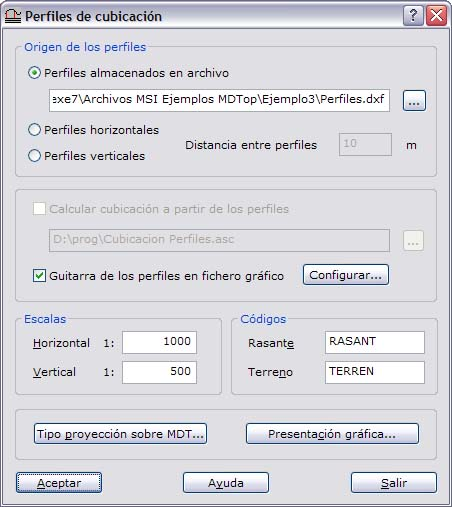
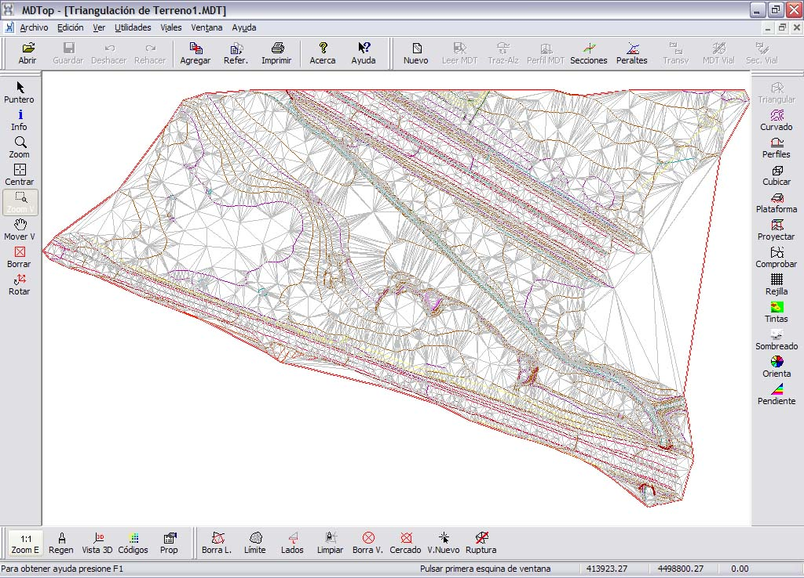
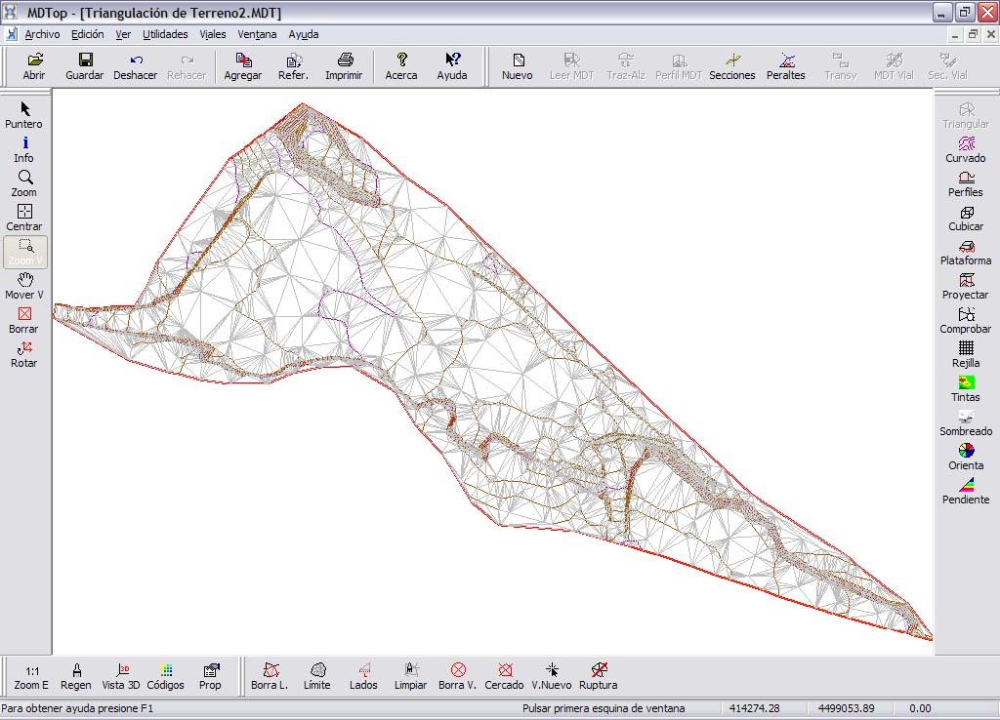
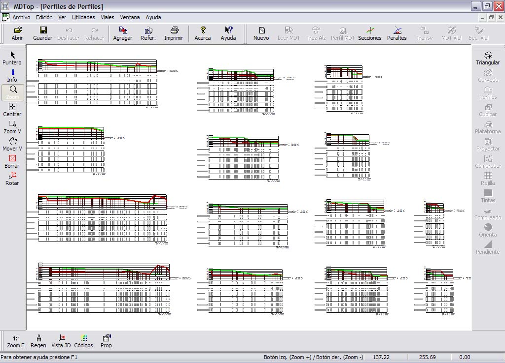
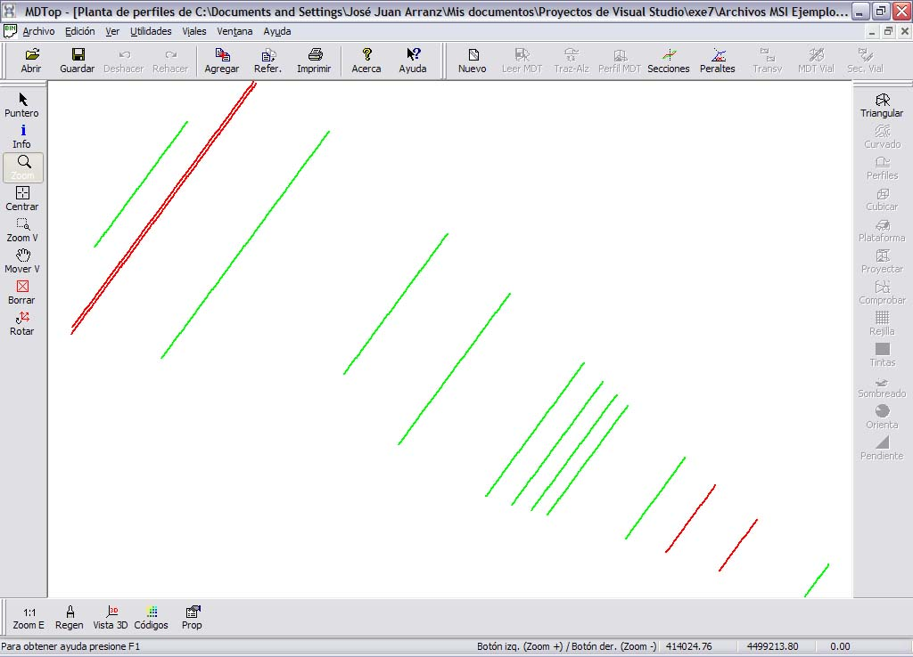
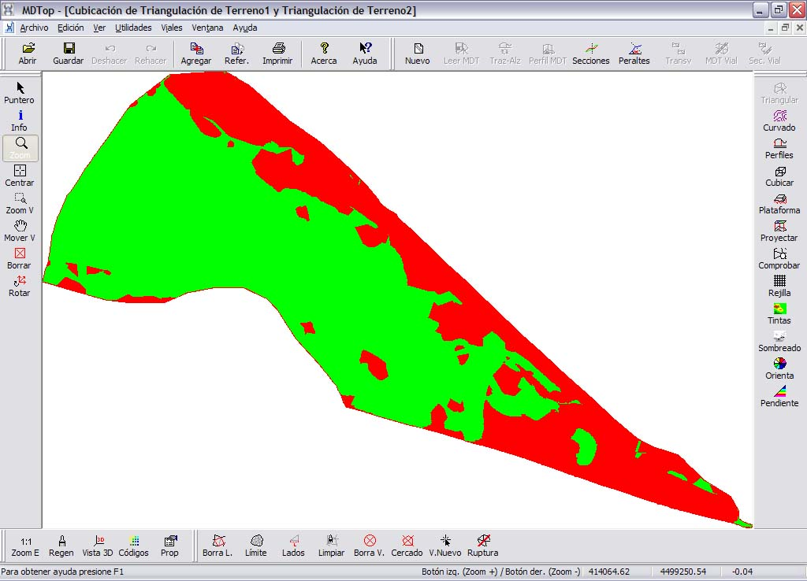

# Ejemplo 3: Cálculo de un movimiento de tierras

[Ejemplos](./)

### Objetivo

Obtener la cubicación de una zona a partir de las cartografías en diferentes épocas.

### Ficheros iniciales

* TERRENO1.DXF: Fichero con formato DXF de AutoCad, con la cartografía en una época anterior.
* TERRENO2.DXF: Fichero con formato DXF de AutoCad, con la cartografía en una época posterior.
* LIMITE.DXF: Fichero con formato DXF de AutoCad, con el límite de la zona que se desea cubicar.
* PERFILES.DXF: Fichero con formato DXF de AutoCad, con líneas de las cuales se desea sacar los perfiles de la cubicación.

### Proceso

* Cargar el fichero TERRENO2.DXF en pantalla. Para ello utilice la orden [Abrir ](../operaciones-con-archivos/untitled.md)del menú del [Botón MDTopX](../introduccion/untitled-10.md), seleccionando el tipo de archivos DXF.
* Llamar a la orden [Triangulación ](../como.../untitled-326.md)de la ficha de herramientas [Herramientas MDT](../fichas-de-herramientas/untitled-249/), que generará un modelo digital del terreno de la cartografía. En el cuadro de diálogo se podrán elegir qué líneas son líneas de ruptura y con qué líneas se desea calcular el modelo digital.

* Guardar el fichero a disco. Para ello utilice la orden Guardar del menú del [Botón MDTopX](../introduccion/untitled-10.md). Guárdelo, por ejemplo, con el nombre que ofrece el programa TRIANGULACION DE TERRENO2.
* Cargar el fichero TERRENO1.DXF en pantalla, igual que se ha hecho con el fichero anterior.
* Llamar a la orden [Triangulación ](../como.../untitled-326.md)de la ficha de herramientas [Herramientas MDT](../fichas-de-herramientas/untitled-249/), que generará un modelo digital del terreno de la cartografía. En el cuadro de diálogo se podrán elegir qué líneas son líneas de ruptura y con qué líneas se desea calcular el modelo digital.
* Llamar a la orden [Cubicación ](../como.../untitled-217.md)de la ficha de herramientas [Herramientas MDT ](../fichas-de-herramientas/untitled-249/)e introducir como archivos de entrada el modelo digital guardado anteriormente \(TRIANGULACION DE TERRENO2\) y el archivo con el límite \(LIMITE.DXF\).

* Configurar los perfiles de la cubicación introduciendo como fichero de entrada, el archivo con los perfiles \(PERFILES.DXF\).

* Se generan dos archivos: uno con la cubicación y otro con los perfiles de la cubicación.

### Ficheros resultantes

* TRIANGULACION DE TERRENO1: Fichero con formato propio de MDTop con el modelo digital del terreno en la época anterior. No incluido para ahorrar espacio.

* TRIANGULACION DE TERRENO2: Fichero con formato propio de MDTop con el modelo digital del terreno en la época posterior. No incluido para ahorrar espacio.

* PERFILES DE PERFILES: Fichero con formato dibujo con los perfiles de la cubicación. Este archivo podrá ser salvado para su edición en formato BIN de DIGI, DXF de AutoCad o DGN de MicroStation.

* PLANTA DE PERFILES DE PERFILES: Fichero con formato dibujo con los la planta de los perfiles de la cubicación. Este archivo podrá ser salvado para su edición en formato BIN de DIGI, DXF de AutoCad o DGN de MicroStation.

* CUBICACION DE TRIANGULACION DE TERRENO1 Y TRIANGULACION DE TERRENO2: Fichero con formato propio de MDTop con la cubicación.

* INFORME.ASC: Fichero con formato ASCII con el informe de la cubicación.

> Resultados de cálculo de cubicación  
> Primer modelo digital : Triangulación de Terreno1.MDT  
> Segundo modelo digital : Triangulación de Terreno2.MDT  
> Fichero con límite : Limite.dxf  
> Calculado en la fecha : 17/07/2007 19:30  
> Espesor de capa de desbroce vegetal : 0.20 metros  
> Tolerancia de proyección : 0.00 metros  
> Calculado con intersección de triángulos
>
> Cálculo de prismas  
> Alturas relativas en metros  
> Superficies en metros cuadrados  
>  Volúmenes en metros cúbicos
>
> Superf. Altura Volumen Sup.Terrap Vol.Terrap Sup.Desmon Vol.Desmon  
> 70.009 -0.019 -1.322 29.549 2.265 40.460 2.729  
> 3.356 -0.090 -0.302 29.549 2.265 43.816 3.031  
> 6.076 -0.110 -0.668 29.549 2.265 49.892 3.700  
> 0.559 -0.123 -0.069 29.549 2.265 50.451 3.769  
> 3.232 -0.123 -0.399 29.549 2.265 53.682 4.167  
> 1.746 -0.123 -0.215 29.549 2.265 55.428 4.382  
> 4.824 -0.120 -0.579 29.549 2.265 60.253 4.961
>
> Datos totales de la cubicación  
> Volumen en terraplén = 7587.856 metros cúbicos  
> Volumen en desmonte = 24003.691 metros cúbicos  
> Superficie en terraplén = 9788.892 metros cuadrados  
> Superficie en desmonte = 18863.894 metros cuadrados  
> Altura máxima en terraplén = 5.367 metros  
> Altura máxima en desmonte = -3.277 metros  
> Altura relativa media = -0.301 metros  
> Prismas medidos = 52905 prismas
>
> Datos de los perfiles proyectados \(en metros cuadrados\):  
> Nombre del perfil Desmonte Terraplén  
> Perfil 1 193.761 46.666  
> Perfil 2 94.410 35.862  
> Perfil 3 16.365 0.000  
> Perfil 4 148.313 17.697  
> Perfil 5 98.222 5.483  
> Perfil 6 58.949 6.012  
> Perfil 7 60.212 11.115  
> Perfil 8 68.686 3.734  
> Perfil 9 54.136 4.884  
> Perfil 10 18.588 4.686

