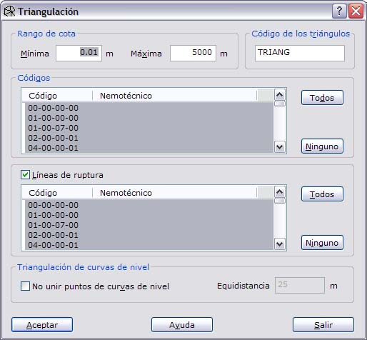
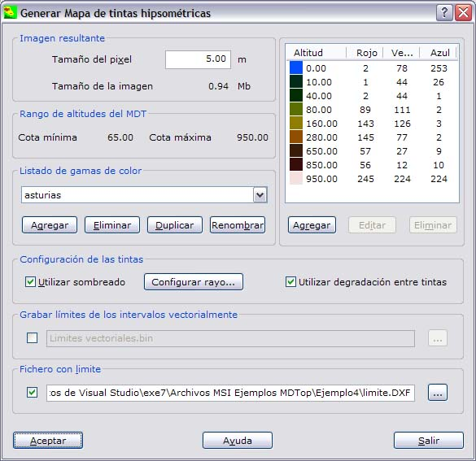
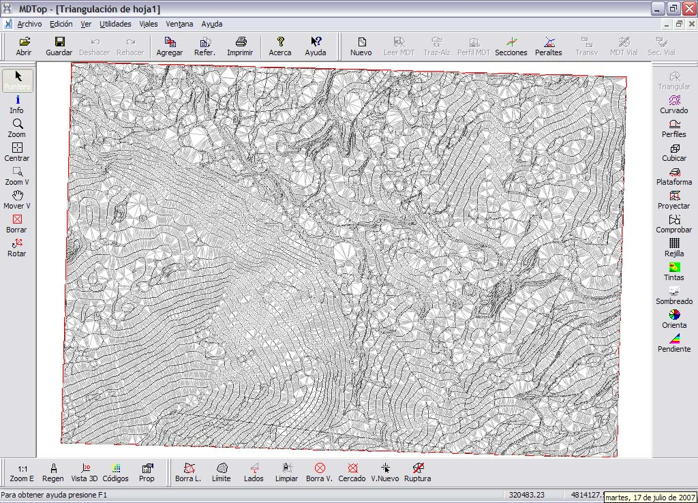
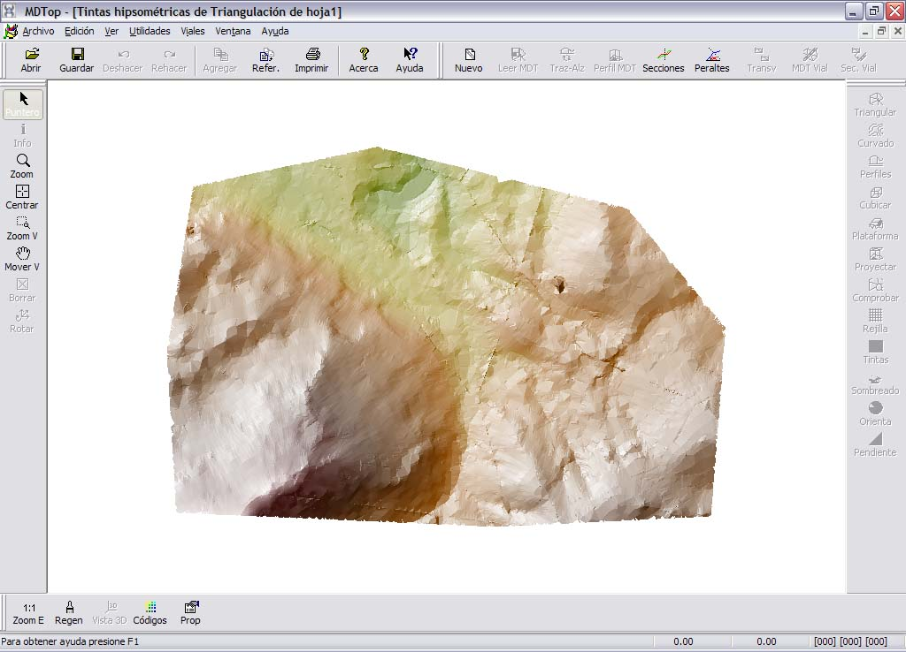

# Ejemplo 4: Obtener un mapa de tintas hipsométricas

[Ejemplos](./)

### Objetivo

Obtener el mapa de tintas hipsométricas de una cartografía.

### Ficheros iniciales

* HOJA1.DXF: Fichero con formato DXF de AutoCad, con la cartografía.
* LIMITE.DXF: Fichero con formato DXF de AutoCad, con el límite de la zona de la cual se quiere obtener el mapa.

### Proceso

* Cargar el fichero HOJA1.DXF en pantalla. Para ello utilice la orden [Abrir ](../operaciones-con-archivos/untitled.md)del menú del [Botón MDTopX](../introduccion/untitled-10.md), seleccionando el tipo de archivos DXF.
* Llamar a la orden [Triangulación ](../como.../untitled-326.md)de la ficha de herramientas [Herramientas MDT](../fichas-de-herramientas/untitled-249/), que generará un modelo digital del terreno de la cartografía. En el cuadro de diálogo se podrán elegir qué líneas son líneas de ruptura y con qué líneas se desea calcular el modelo digital.

* Llamar a la orden [Tintas hipsométricas ](../como.../untitled-282.md)de la ficha de herramientas [Herramientas MDT ](../fichas-de-herramientas/untitled-249/)y configurar el aspecto del mapa de tintas hipsométricas: gamas de color, sombreado, archivo con límite...

* Se genera un archivo ráster con la imagen.

### Ficheros resultantes

* TRIANGULACION DE HOJA1.MDT: Fichero con formato propio de MDTop con el modelo digital del terreno. No incluido para ahorrar espacio.

* TINTAS HIPSOMETRICAS DE TRIANGULACION DE HOJA1: Fichero con formato de imagen con el mapa de tintas hipsométricas. Este archivo podrá ser salvado en formato TIFF, BMP o JPEG.

* TINTAS HIPSOMETRICAS DE TRIANGULACION DE HOJA1.ORT: Fichero propio de MDTop, para facilitar la georreferenciación del archivo ráster.

> > \[ort\]  
> > Pixel=5.00  
> > X=319694.57  
> > Y=4814338.39  
> > Z=0.00  
> > EscalaZ=1.000000

