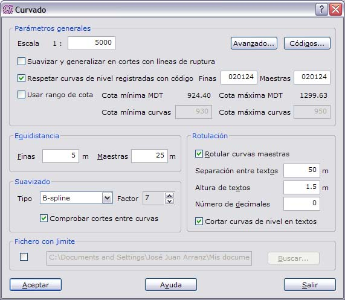
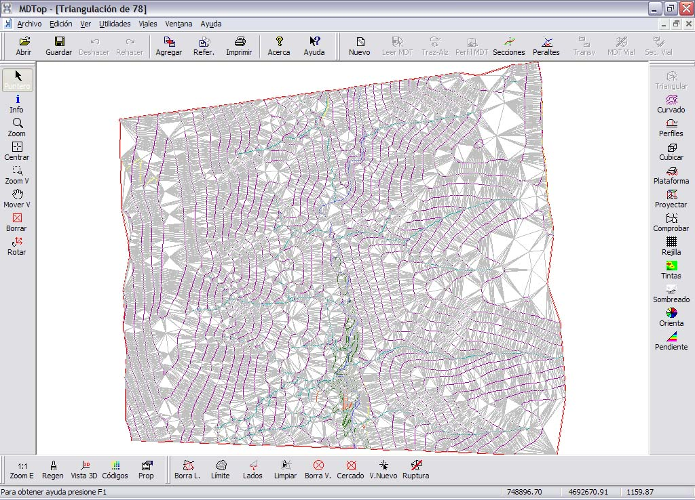
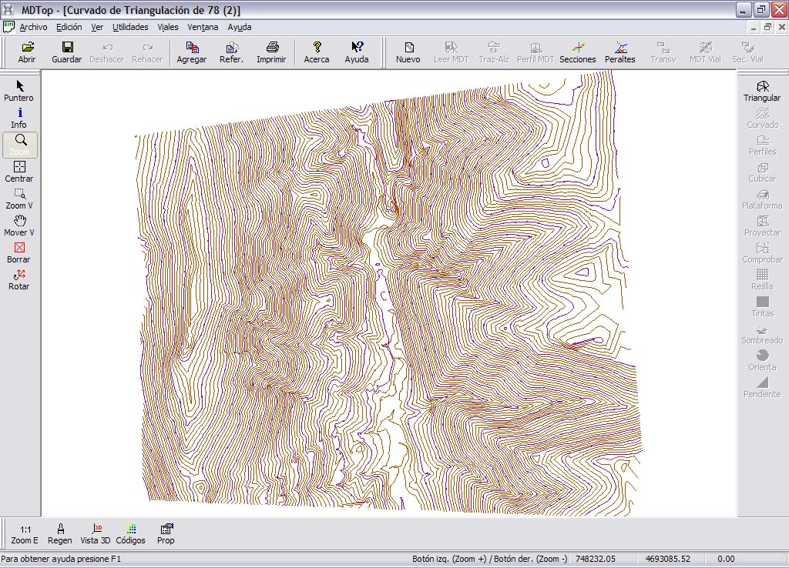

# Ejemplo 5: Curvado a partir de otro curvado

[Ejemplos](./)

### Objetivo

Obtener el curvado de una zona con una equidistancia de cinco metros, restituida sólo con curvas de cinco veinticinco metros.

### Fichero inicial

* 78.BIN: Fichero con formato BIN de DIGI con la restitución fotogramétrica.

### Proceso

* Cargar el fichero 78.BIN en pantalla. Para ello utilice la orden [Abrir ](../operaciones-con-archivos/untitled.md)del menú del [Botón MDTopX](../introduccion/untitled-10.md), seleccionando el tipo de archivos DIGI.
* Llamar a la orden [Triangulación ](../como.../untitled-326.md)de la ficha de herramientas [Herramientas MDT](../fichas-de-herramientas/untitled-249/), que generará un modelo digital del terreno de la cartografía. En el cuadro de diálogo se podrán elegir qué líneas son líneas de ruptura y con qué líneas se desea calcular el modelo digital.

* Llamar a la orden [Curvado ](../como.../untitled-219.md)de la ficha de herramientas [Herramientas MDT ](../fichas-de-herramientas/untitled-249/)y configurar el curvado de salida con equidistancia de cinco metros.

### Ficheros resultantes

* TRIANGULACION DE 78.MDT: Fichero con formato propio de MDTop con el modelo digital del terreno. No incluido para ahorrar espacio.

* CURVADO DE 78: Fichero con formato dibujo con el nuevo curvado. Este archivo podrá ser salvado para su edición en formato BIN de DIGI, DXF de AutoCad o DGN de MicroStation.

